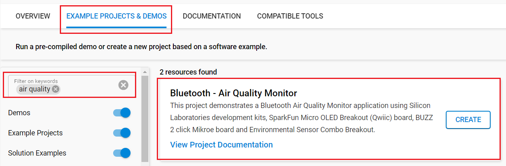

# Bluetooth - Air Quality Monitor #

[%20board-green)](https://www.sparkfun.com/products/14532)

## Overview ##

This project aims to implement an air quality monitor and notification system using Silicon Labs development kits and external sensors integrated with the BLE wireless stack. The block diagram of this application is shown in the image below:

More detailed information can be found in the section [How it works](#how-it-works).

This code example referred to the following code examples. More detailed information can be found here:

- [OLED SSD1306 driver](https://github.com/SiliconLabs/third_party_hw_drivers_extension/tree/master/driver/public/silabs/micro_oled_ssd1306)
- [Buzzer driver](https://github.com/SiliconLabs/third_party_hw_drivers_extension/tree/master/driver/public/mikroe/buzz2_cmt_8540s_smt)
- [CCS811 - Air Quality Sensor (Sparkfun)](https://github.com/SiliconLabs/third_party_hw_drivers_extension/tree/master/driver/public/silabs/environmental_bme280_ccs811)
- [Bluetooth security feature](https://github.com/SiliconLabs/bluetooth_stack_features/tree/master/security)

---

## Table Of Contents ##

- [SDK version](#sdk-version)
- [Software Required](#software-required)
- [Hardware Required](#hardware-required)
- [Connections Required](#connections-required)
- [Setup](#setup)
  - [Based on an example project](#based-on-an-example-project)
  - [Start with a "Bluetooth - SoC Empty" project](#start-with-a-bluetooth---soc-empty-project)
- [How It Works](#how-it-works)
  - [Application Overview](#application-overview)
  - [GATT Database](#gatt-database)
  - [Air Quality Monitor Implementation](#air-quality-monitor-implementation)
  - [OLED Display](#oled-display)
  - [Testing](#testing)
- [Report Bugs & Get Support](#report-bugs--get-support)

---

## SDK version ##

- [Simplicity SDK v2025.6.2](https://github.com/SiliconLabs/simplicity_sdk/releases/tag/v2025.6.2)
- [Third Party Hardware Drivers v4.4.1](https://github.com/SiliconLabs/third_party_hw_drivers_extension)

---

## Software Required ##

- [Simplicity Studio v5 IDE](https://www.silabs.com/developers/simplicity-studio)
- [Simplicity Connect Mobile App](https://www.silabs.com/developer-tools/simplicity-connect-mobile-app)

---

## Hardware Required ##

- 1x [Bluetooth Low Energy Explorer Kit](https://www.silabs.com/development-tools/wireless/bluetooth). For example, [BGM220-EK4314A](https://www.silabs.com/development-tools/wireless/bluetooth/bgm220-explorer-kit)
- 1x [SparkFun Micro OLED Breakout (Qwiic) board](https://www.sparkfun.com/products/14532)
- 1x [BUZZ 2 click](https://www.mikroe.com/buzz-2-click)
- 1x SparkFun CCS811/BME280 Combo Board
- 1x smartphone running the 'Simplicity Connect' mobile app

---

## Connections Required ##

The hardware connection is shown in the image below:

---

## Setup ##

To test this application, you can either create a project based on an example project or start with a "Bluetooth - SoC Empty" project based on your hardware. You should connect your board to the PC using a MicroUSB cable.

> [!NOTE]
>
> - Make sure that the [Third Party Hardware Drivers extension](https://github.com/SiliconLabs/third_party_hw_drivers_extension) is installed as part of the SiSDK and the [bluetooth_applications](https://github.com/SiliconLabs/bluetooth_applications) repository is added to [Preferences > Simplicity Studio > External Repos](https://docs.silabs.com/simplicity-studio-5-users-guide/latest/ss-5-users-guide-about-the-launcher/welcome-and-device-tabs).
>
> - SDK Extension must be enabled for the project to install the required components.

### Based on an example project ###

1. From the Launcher Home, add your board to My Products, click on it, and click on the **EXAMPLE PROJECTS & DEMOS** tab. Find the example project filtering by 'air quality'.

   

2. Click **Create** button on the **Bluetooth - Air Quality Monitor** example. Example project creation dialog pops up -> click Create and Finish and Project should be generated.

3. Build and flash this example to the board.

### Start with a "Bluetooth - SoC Empty" project ###

1. Create a **Bluetooth - SoC Empty** project for your hardware using Simplicity Studio 5.

2. Copy all the header files and source files in the 'inc' and 'src' folders to the root folder of the project (overwriting the existing files).

3. Open the .slcp file. Select the **SOFTWARE COMPONENTS tab** and install the software components:

   - [Services] → [IO Stream] → [IO Stream: USART] → vcom
   - [Application] → [Utility] → [Log]
   - [Application] → [Utility] → [Timer]
   - [Platform] → [Driver] → [I2C] → [I2CSPM] → qwiic
   - [Platform] → [Driver] → [PWM] → [PWM] → mikroe
   - [Platform] → [Driver] → [Button] → [Simple Button] → btn0
   - [Third Party Hardware Drivers] → [Sensors] → CCS811 - [Air Quality Sensor (Sparkfun)]
   - [Third Party Hardware Drivers] → [Audio & Voice] → [CMT_8540S_SMT - Buzz 2 Click (Mikroe)]
   - [Third Party Hardware Drivers] → [Display & LED] → [SSD1306 - Micro OLED Breakout (Sparkfun) - I2C]
   - [Third Party Hardware Drivers] → [Services] → [GLIB - OLED Graphics Library]
   - [Bluetooth] → [OTA] → [In-Place OTA DFU] → uninstall
   - [Platform] → [Bootloader Application Interface] → uninstall.

4. Import the GATT configuration:

   - Open the .slcp file in the project again.
   - Select the CONFIGURATION TOOLS tab and open the "Bluetooth GATT Configurator".
   - Find the Import button and import the [gatt_configuration.btconf](config/btconf/gatt_configuration.btconf) file.
   - Save the GATT configuration (ctrl-s).

5. Build and flash this project to the board.

---

## How it Works ##

### Application Overview ###

### GATT Database ###

The application is based on the Bluetooth - SoC Empty example. Since the example already has the Bluetooth GATT server, advertising, and connection mechanisms, only minor changes are required.

- BLE advertiser name: **Air Quality**
- [**Service**] **Air Quality** - UUID: `3a79c933-c922-45c7-b5e7-9bdefd126dd9`
  - [**Char**] **Alarm Enabled** - UUID: `ec26adea-75af-409d-b267-51a4e753e9ea`
    - [**Read**] - Get alarm enabled
    - [**Write**] - Set alarm enabled (1 - enable, 0 - disable)
  - [**Char**] **Buzzer Volume** - UUID: `c5fd8492-9c55-4c18-b761-99b8cf9bca77`
    - [**Read**] - Get configured buzzer volume
    - [**Write**] - Set buzzer volume (0 - 10)
  - [**Char**] **Measurement Interval** - UUID: `98205b49-a9e1-4bfc-a18d-60d36798397f`
    - [**Read**] - Get configured measurement interval in s
    - [**Write**] -  Set configured measurement interval  in s (1 - 30)
  - [**Char**] **CO2 Threshold** - UUID: `0af3e688-a5a8-435d-bf6a-0f2443428993`
    - [**Read**] - Get CO2 Threshold (ppm)
    - [**Write**] - Set CO2 Threshold (ppm)
  - [**Char**] **tVOC Threshold** - UUID: `aad57e11-edb0-4a0c-8590-aad8adbbd23d`
    - [**Read**] - Get tVOC Threshold (ppb)
    - [**Write**] - Set tVOC Threshold (ppb)
  - [**Char**] **CO2** - UUID: `c099dd9-7887-4ca6-a169-92a5e9ed7926`
    - [**Read**] - Get the latest measured CO2 level (ppm)
    - [**Notify**] - Get the latest measured CO2 level (ppm) automatically
  - [**Char**] **tVOC** - UUID: `d07aeadd-1633-48ae-a114-800cfdaa0d79`
    - [**Read**] - Get the latest measured tVOC level (ppb)
    - [**Notify**] - Get the latest measured tVOC level (ppb) automatically
  - [**Char**] **Alarm Status** - UUID: `d07aeadd-1633-48ae-a114-800cfdaa0d79`
    - [**Read**] - Get the latest Alarm Status
    - [**Notify**] - Get the latest Alarm Status automatically
  - [**Char**] **Air Quality Index** - UUID: `ca19fb61-b04b-409a-8a18-c37560bdf05a`
    - [**Read**] - Get the latest Air Quality Index
    - [**Notify**] - Get the latest Air Quality Index automatically

### Air Quality Monitor Implementation ###

The Initialization software flow is as follows:

1. First, the software initializes the peripherals, the Bluetooth stack, and logging to the virtual COM port.

2. After the *sl_bt_evt_system_boot_id* event arrives, it sets up the security manager to bond with an iOS/Android device. Then, it starts advertising.

3. Every time the timer expires, an Air quality monitor event handler retrieves and processes the measured air quality data as described below:

   

4. When the BTN0 button is pressed, the software checks the notification feature status, and buzzer state by the flowchart below:

   

### OLED Display ###

Measured values are displayed on the OLED display:

- CO2 (ppm)

- tVOC (ppb)

- The health impact of the measured air quality levels is described in the following document: [calculating an actionable indoor air quality index](https://www.breeze-technologies.de/blog/calculating-an-actionable-indoor-air-quality-index/).

More detailed information can be found in the section [Testing](#testing).

### Testing ###

Upon reset, the application will display the Silicon Labs logo on the OLED screen for a few seconds. Then you can check the measured CO2 and tVOC values on the OLED screen. You should expect a similar output to the one below.

> [!NOTE]
>
> The measured CO2 and tVOC values will be more accurate after the sensor is warmed up.

Follow the below steps to test the example with the Simplicity Connect app:

1. Open the Simplicity Connect app on your smartphone and allow the permission requested the first time it is opened.

2. Find your device in the Bluetooth Browser, advertising as *Air Quality*, and tap Connect. Accept the pairing request if prompted.

   

3. Navigate to the *Unknown Services* in the GATT database.

4. Try to read, write, re-read the characteristics, and check the value.

5. You can launch the Console that is integrated into Simplicity Studio or can use a third-party terminal tool like Tera Term to receive the data from the virtual COM port. Use the following UART settings: baud rate 115200, 8N1, no flow control. You should expect a similar output to the one below.

   

> [!TIP]
> The application handles characteristic values as hexadecimal numbers in Little Endian format. So, to write a 2-byte attribute—for example, to configure the setpoint parameter to 300 (representing 30 °C)—the value 2C01 should be entered in the HEX field.

---

## Report Bugs & Get Support ##

To report bugs in the Application Examples projects, please create a new "Issue" in the "Issues" section of [bluetooth_applications](https://github.com/SiliconLabsSoftware/bluetooth_applications) repo. Please reference the board, project, and source files associated with the bug, and reference line numbers. If you are proposing a fix, also include information on the proposed fix. Since these examples are provided as-is, there is no guarantee that these examples will be updated to fix these issues.

Questions and comments related to these examples should be made by creating a new "Issue" in the "Issues" section of [bluetooth_applications](https://github.com/SiliconLabsSoftware/bluetooth_applications) repo.

---
