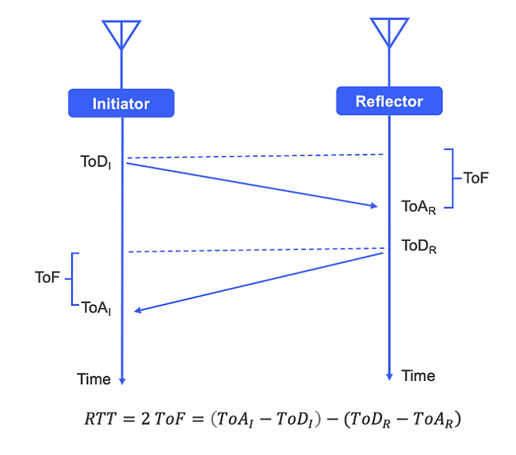
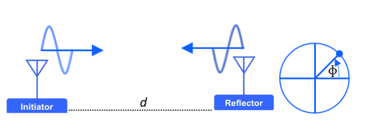
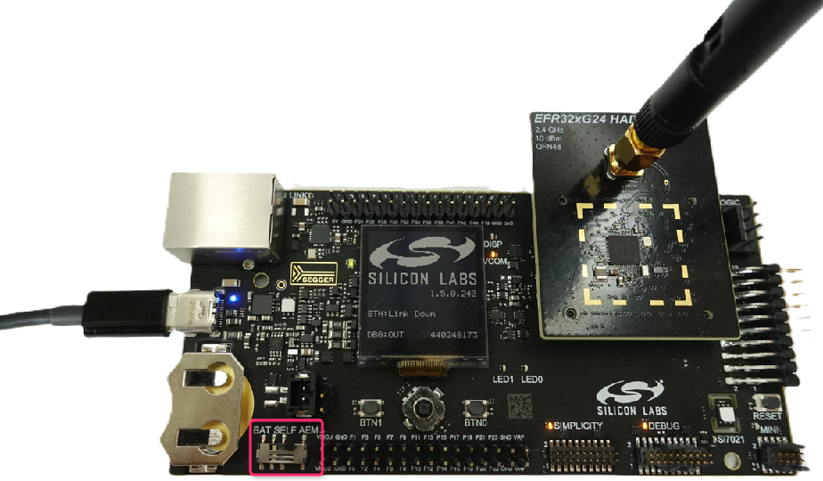
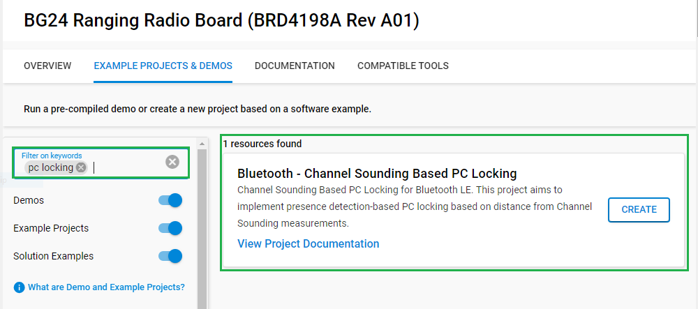
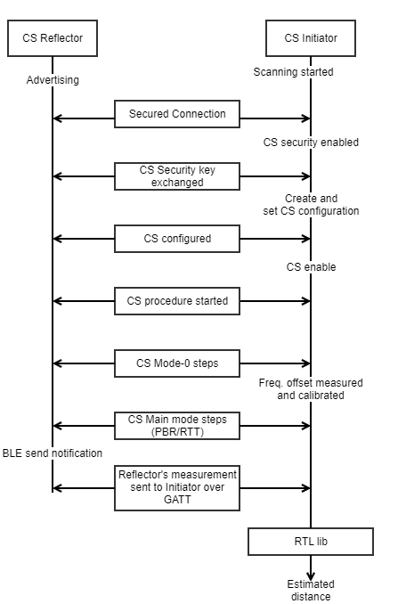
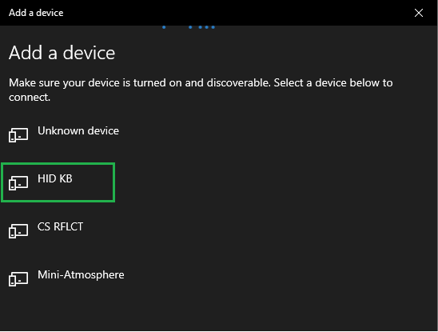
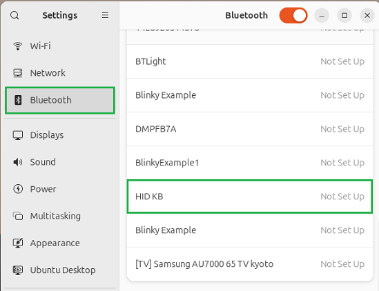
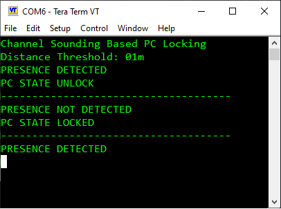
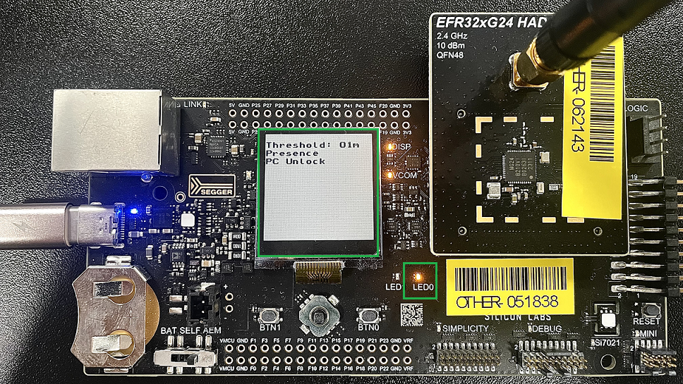

# Bluetooth - Channel Sounding Based PC Locking #

## Overview ##

Channel Sounding (CS), previously referred to as High Accuracy Distance Measurement (HADM), uses Phase-Based Ranging (PBR), Round Trip Time (RTT), or both to accurately measure the distance between two Bluetooth Low Energy (BLE) connected devices.

- It enables connection-oriented two-way ranging.

- It supports up to four antenna paths between devices, which minimizes multipath effects and enhances accuracy.

- It offers enhanced built-in security features to mitigate the risks of man-in-the-middle or relay attacks.

Channel sounding is a method for estimating the distance between two devices, designated as the initiator and the reflector. They exchange information across 72 RF physical channels, with the initiator transmitting first, followed by the response from the reflector. This alternating transmission and reception enable precise distance measurement. The technique employs PBR, RTT, or both for accurate coordination across the 2.4 GHz spectrum. It also supports one to four antenna paths to improve measurement accuracy and reliability.

- Round-Trip Time (RTT) in a communication channel refers to the duration a signal takes to travel from the initiator to the reflector and back again. By assessing the Time of Flight (ToF)—the time it takes for a packet to be exchanged between the initiator and the reflector—the distance can be estimated. To achieve this, both devices record the Time of Arrival (ToA) and Time of Departure (ToD). Analyzing the differences between ToA and ToD for both the initiator and the reflector provides the data necessary for reliable distance calculation. Additionally, from a security perspective, since time cannot be reversed, RTT is considered highly secure.

  

- Phase-Based Ranging (PBR) utilizes the principle of phase rotation in RF signals to determine distances. In this process, the initiator sends a signal with specific frequency and amplitude information, and the reflector measures the phase of this received signal before sending a response. By comparing the phase differences between the signals from both devices, the relative distance can be determined. PBR offers a significant security advantage, especially compared to methods like RSSI (Received Signal Strength Indicator). The complexity of manipulating phase information makes PBR a more secure method for distance measurement.

  

This project implements a PC locking application based on presence detection using distance measurements from channel sounding. The main goal is to determine whether the user is present by analyzing their channel sounding distance. If the user is no longer detected, the board will send a command via the BLE HID protocol to lock the PC.

> [!NOTE]
>
> This application supports PCs running either Windows or Linux.

---

## Table Of Contents ##

- [SDK version](#sdk-version)
- [Software Required](#software-required)
- [Hardware Required](#hardware-required)
- [Connections Required](#connections-required)
- [Setup](#setup)
  - [Create a project based on an example project](#create-a-project-based-on-an-example-project)
  - [Start with a "Bluetooth - SoC Empty" project](#start-with-a-bluetooth---soc-empty-project)
- [How It Works](#how-it-works)
- [Testing](#testing)
- [Report Bugs & Get Support](#report-bugs--get-support)

---

## SDK version ##

- [SiSDK v2025.6.2](https://github.com/SiliconLabs/simplicity_sdk/releases/tag/v2025.6.2)

---

## Software Required ##

- [Simplicity Studio v5 IDE](https://www.silabs.com/developers/simplicity-studio)

---

## Hardware Required ##

- [EFR32xG24 Channel Sounding Pro Kit](https://www.silabs.com/development-tools/wireless/efr32xg24-channel-sounding-pro-kit?tab=overview)  
  *or*  
- 2x [EFR32xG24 Channel Sounding Dev Kit](https://www.silabs.com/development-tools/wireless/efr32xg24-channel-sounding-dev-kit?tab=overview)

---

## Connections Required ##

To run the channel sounding example, two setups are required: one for the Initiator (running the "Bluetooth - Channel Sounding Based PC Locking" example) and one for the Reflector (running the "Bluetooth - SoC CS Reflector" example).

The user should connect the EFR32xG24 Channel Sounding Radio Board to the Wireless Pro Kit Mainboard, and then connect the board to the laptop or PC using a USB Type-C cable.

---

## Setup ##

To test this application, you can either create a project based on an example project or start with a "Bluetooth - SoC Empty" project based on your hardware.

> [!NOTE]
>
> Make sure that the [bluetooth_applications](https://github.com/SiliconLabsSoftware/bluetooth_applications) repository is added to [Preferences > Simplicity Studio > External Repos](https://docs.silabs.com/simplicity-studio-5-users-guide/latest/ss-5-users-guide-about-the-launcher/welcome-and-device-tabs).

### Create a project based on an example project ###

1. From the Launcher Home, add your hardware to My Products, click on it, and click on the **EXAMPLE PROJECTS & DEMOS** tab. Find the example project filtering by "pc locking".

2. Click the **Create** button for the **Bluetooth - Channel Sounding Based PC Locking** example. When the project creation dialog appears, click **Create** and then **Finish**. The project will be generated.

   

3. Build and flash this example to the board.

### Start with a "Bluetooth - SoC Empty" project ###

1. Create a **Bluetooth - SoC Empty** project for your hardware using Simplicity Studio 5.

2. Copy all attached files in the *inc*, *src*, and *config* folders into the project root folder (overwriting existing files).

3. Import the GATT configuration:

   - Open the *.slcp file in the project.

   - Select the **CONFIGURATION TOOLS** tab and open the **Bluetooth GATT Configurator**.

   - Find the Import button and import the attached `config/gatt_configuration.btconf` file.

   - Save the GATT configuration (Ctrl+S).

4. Open the *.slcp file. Select the SOFTWARE COMPONENTS tab, and install the following software components:

   - [Services] → [IO Stream] → [IO Stream: USART] → default instance name: *vcom*

   - [Services] → [Timers] → [Sleep Timer]

   - [Application] → [Utility] → [Log]

   - [Application] → [Utility] → [Assert]

   - [Platform] → [Driver] → [LED] → [Simple LED] → default instance name: *led0*

   - [Platform] → [Driver] → [Button] → [Simple Button] → default instance name: *btn0*

   - [Bluetooth] → [Application] → [Miscellaneous] → [BLE Peer Manager Central]

   - [Bluetooth] → [Application] → [Miscellaneous] → [CS Antenna]

   - [Bluetooth] → [Application] → [Miscellaneous] → [CS Initiator]

   - [Platform] → [Driver] → [GLIB Graphics Library]

   - [Platform] → [Board] → [Board Control] → [General] → [Enable Virtual COM UART]

   - [Platform] → [Board] → [Board Control] → [General] → [Enable Display]

   - [Bluetooth] → [Bluetooth Host (Stack)] → [Features with Commands and Events] → [Channel Sounding]

   - [Bluetooth] → [Bluetooth LE Controller (Link Layer)] → [Features with Commands and Events] → [Legacy Advertising]

5. Build and flash the project to your device.

> [!NOTE]
>
> A bootloader needs to be flashed to your board if the project starts from the "Bluetooth - SoC Empty" project, see [Bootloader](https://github.com/SiliconLabs/bluetooth_applications/blob/master/README.md#bootloader) for more information.

---

## How It Works ##

Bluetooth - Channel Sounding Based PC Locking is a project that can be used to test the channel sounding feature. In the provided CS setup, the application establishes a connection to a reflector (in this case, the user carries the unmodified reflector device, which is part of the channel sounding setup). The application then operates in either PBR or RTT CS measurement modes to estimate the distance. After the measurement process is complete, the distance value is used to detect the presence of the user. The application compares the distance value to a configured threshold (these default values can be found and modified in the file "config/app_config.h"). If presence is lost, the board sends a command via the BLE HID protocol to lock the PC.

The measurement process also supports Moving Object Tracking and Stationary Object Tracking algorithm modes. In Moving Object Tracking mode, distance is calculated for every CS procedure, while in Stationary Object Tracking mode, the calculation requires data from multiple CS procedures. To select a different algorithm mode, press the push button during device RESET. Pressing BTN0 will toggle the object tracking mode from the default value.

---

## Testing ##

Follow the below steps to test the example:

1. Build and flash the "Bluetooth - SoC CS Reflector" application to one board (reflector device). In this case, the user carries the unmodified reflector device, which is part of the channel sounding setup.

2. Build and flash the "Bluetooth - Channel Sounding Based PC Locking" application to another board (initiator device).

3. The default object tracking mode is "Moving Object Tracking". Press BTN0 while resetting the initiator device to select the "Stationary Object Tracking" algorithm mode.

4. After startup, the initiator device will scan for a reflector device running the "Bluetooth - SoC CS Reflector" example application.

5. When found, the initiator device will establish a connection to the reflector device and start the distance measurement process. Simultaneously, the program will advertise to the laptop via BLE as an HID keyboard device.

6. On the laptop: 

   - With Windows Operating System: Open "Bluetooth & other device" → "Add Bluetooth or other device" → "Bluetooth" → connect to the "HID KB" device. 
   - With Linux Operating System: Open "Settings" → "Bluetooth" → connect to the "HID KB" device.
   - The Bluetooth connect setup is shown in the image below:

      | Windows Operating System  | Linux Operating System |
      | ------------- | ------------- |
      |   |  |

7. When a user (carrying the reflector device) moves away from their PC, the program will compare the distance value to a configured threshold (these default values can be found and modified in the file "config/app_config.h"). If presence is lost, the board will send the 'Windows + L' key combination via the BLE HID protocol to lock the PC.

8. You can launch the Console integrated into Simplicity Studio or use a third-party terminal tool like "Tera Term" to receive logs from the virtual COM port.

   

   If the user is using the Channel Sounding Radio Board (BRD4198A), the program will display the distance threshold, presence status, and PC locking status on the integrated LCD, and control LED0 according to presence

   

   There are some definitions in 'config/app_config.h' that define the channel sounding measurement unit and the distance threshold value used to detect presence. Change these definitions as desired.

> [!NOTE]
>
> In the case of stationary object tracking mode multiple CS procedure data will be required. 

## Known issues and limitations ##

- Only one initiator instance can be created.
- If RTT mode is used with the "Stationary Object Tracking" algorithm, the behavior will be the same as RTT with the "Moving Object Tracking" algorithm.

---

## Report Bugs & Get Support ##

To report bugs in the Application Examples projects, please create a new "Issue" in the "Issues" section of [bluetooth_applications](https://github.com/SiliconLabsSoftware/bluetooth_applications) repo. Please reference the board, project, and source files associated with the bug, and reference line numbers. If you are proposing a fix, also include information on the proposed fix. Since these examples are provided as-is, there is no guarantee that these examples will be updated to fix these issues.

Questions and comments related to these examples should be made by creating a new "Issue" in the "Issues" section of [bluetooth_applications](https://github.com/SiliconLabsSoftware/bluetooth_applications) repo.

---
