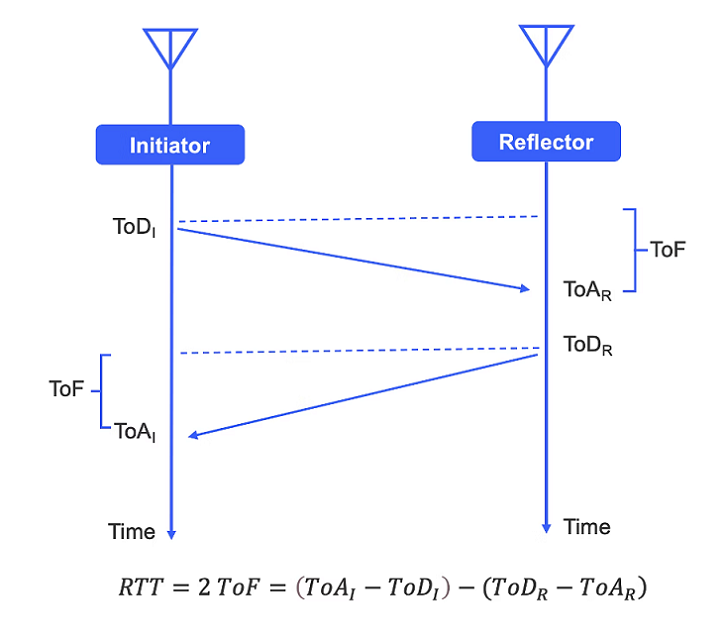
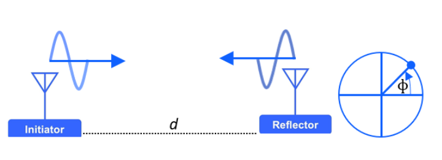
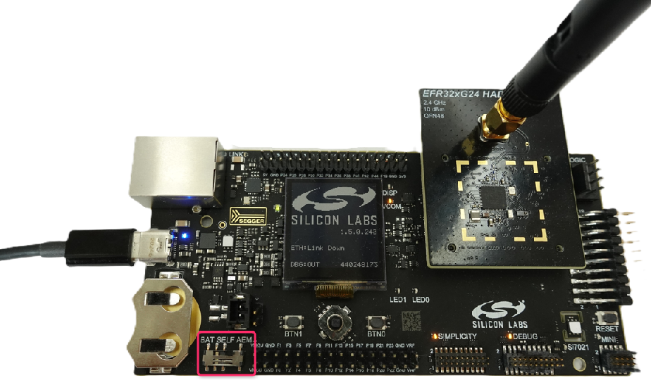
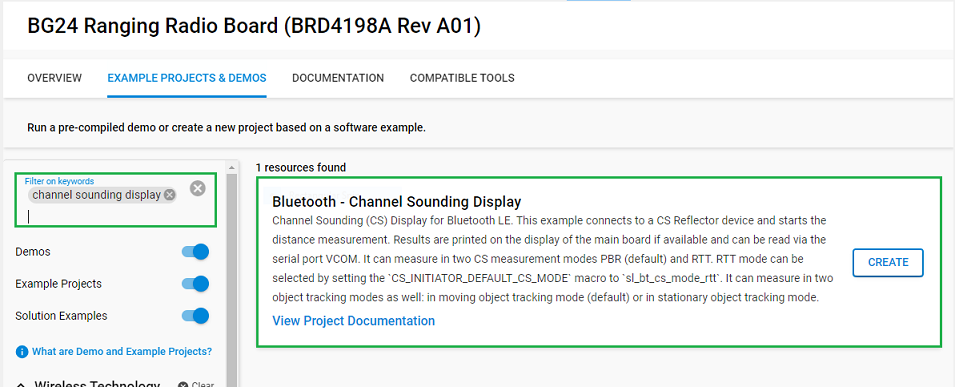
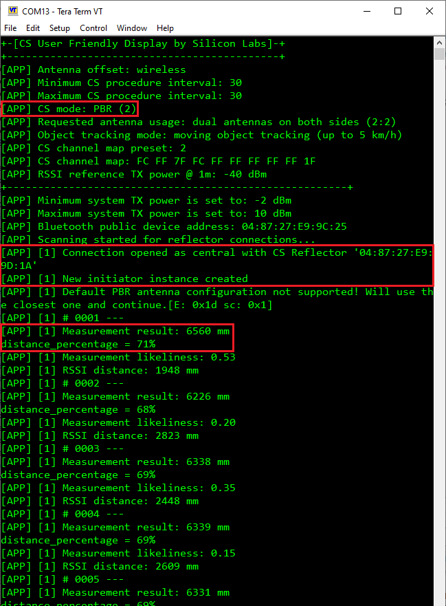
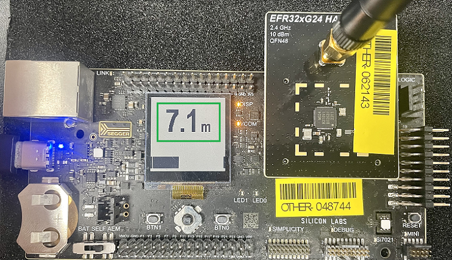
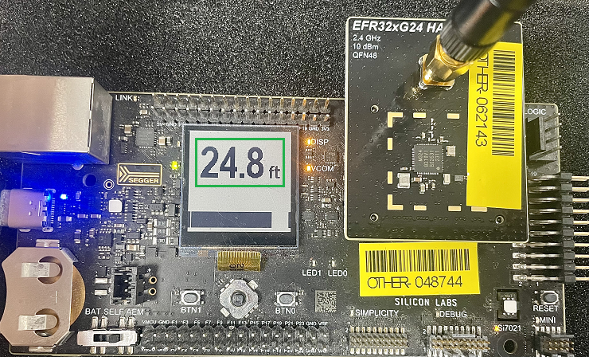

# Bluetooth - Channel Sounding Display #

## Overview ##

Channel Sounding (CS), previously referred to as High Accuracy Distance Measurement (HADM), uses Phase-Based Ranging (PBR), Round Trip Time (RTT), or both to accurately measure the distance between two Bluetooth Low Energy connected devices.

- It enables connection-oriented 2-way ranging.

- Supports up to four antenna paths between devices - minimizes multipath effects and enhances accuracy.

- Offers enhanced built-in security features to mitigate the risks of man-in-the-middle or relay attacks.

Channel sounding is a method for estimating distances between two devices, designated as the initiator and the reflector. They exchange information across 72 RF physical channels, with the initiator transmitting first, followed by the response of the reflector. This alternating transmission and reception enable precise distance measurements. The technique employs Phase-Based Ranging (PBR) or Round-Trip Time (RTT) or both for accurate coordination across the 2.4 GHz spectrum. It also supports one to four antenna paths to improve measurement accuracy and reliability.

- Round trip time (RTT) in a communication channel refers to the duration a signal takes to travel from the initiator to the reflector and back again. By assessing the Time of Flight (ToF) — the time it takes for a packet to be exchanged between the initiator and the reflector — the distance can be estimated. To achieve this, both devices record the Time of Arrival (ToA) and the Time of Departure (ToD). Analyzing the differences between ToA and ToD for both the initiator and the reflector provides the data necessary for a reliable distance calculation. Additionally, in terms of security, since time cannot be reversed, RTT is considered highly secure.

  

- Phase-Based Ranging (PBR) utilizes the principle of phase rotation in RF signals to determine distances. In this process, the initiator sends a signal with specific frequency and amplitude information, and the reflector measures the phase of this received signal before sending a response. By comparing the phase differences between the signals from both devices, their relative distance can be determined. PBR offers a significant security advantage, especially compared to methods like RSSI (Received Signal Strength Indicator). The complexity of manipulating phase information makes PBR a more secure technology for distance measurement.

  

This project aims to implement a custom and user-friendly UI for WTSK-based channel sounding boards - namely the BRD4198A.

---

## Table Of Contents ##

- [SDK version](#sdk-version)
- [Software Required](#software-required)
- [Hardware Required](#hardware-required)
- [Connections Required](#connections-required)
- [Setup](#setup)
  - [Based on an example project](#based-on-an-example-project)
  - [Start with a "Bluetooth - SoC Empty" project](#start-with-a-bluetooth---soc-empty-project)
- [How It Works](#how-it-works)
  - [Testing](#testing)
- [Known issues and limitations](#known-issues-and-limitations)
- [Report Bugs & Get Support](#report-bugs--get-support)

---

## SDK version ##

- [Simplicity SDK v2024.12.2](https://github.com/SiliconLabs/simplicity_sdk)

---

## Software Required ##

- [Simplicity Studio v5 IDE](https://www.silabs.com/developers/simplicity-studio)

---

## Hardware Required ##

- [EFR32xG24 Channel Sounding Pro Kit](https://www.silabs.com/development-tools/wireless/efr32xg24-channel-sounding-pro-kit?tab=software-tools)

---

## Connections Required ##

To run the channel sounding example, the user needs two setups: one for the Initiator (run Bluetooth - Channel Sounding Display example) and one for the Reflector (run Bluetooth - SoC CS Reflector example).

The user connects the EFR32xG24 Channel Sounding Radio Board to the Wireless Pro Kit Mainboard and then connects the board to the Laptop/PC via USB type C cable.

---

## Setup ##

To test this application, you can either create a project based on an example project or start with a "Bluetooth - SoC Empty" project based on your hardware.

> [!NOTE]  
>
> Make sure that the [bluetooth_applications](https://github.com/SiliconLabsSoftware/bluetooth_applications) repository is added to [Preferences > Simplicity Studio > External Repos](https://docs.silabs.com/simplicity-studio-5-users-guide/latest/ss-5-users-guide-about-the-launcher/welcome-and-device-tabs).

### Based on an example project ###

1. From the Launcher Home, add your hardware to My Products, click on it, and click on the **EXAMPLE PROJECTS & DEMOS** tab. Find the example project filtering by "channel sounding display".

2. Click **Create** button on the example **Bluetooth - Channel Sounding Display**. Example project creation dialog pops up -> click Create and Finish and Project should be generated.
   

3. Build and flash this example to the board.

### Start with a "Bluetooth - SoC Empty" project ###

1. Create a **Bluetooth - SoC Empty** project for your hardware using Simplicity Studio 5.

2. Copy all attached files in *inc*, *src* and *config* folders into the project root folder (overwriting existing).

3. Import the GATT configuration:

   - Open the .slcp file in the project.

   - Select the **CONFIGURATION TOOLS** tab and open the **Bluetooth GATT Configurator**.

   - Find the Import button and import the attached `config/gatt_configuration.btconf` file.

   - Save the GATT configuration (ctrl-s).

4. Open the .slcp file. Select the **SOFTWARE COMPONENTS tab** and install the software components:

   - [Services] → [IO Stream] → [IO Stream: USART] → default instance name: *vcom*
   - [Services] → [Timers] → [Sleep Timer]
   - [Application] → [Utility] → [Log]
   - [Application] → [Utility] → [Assert]
   - [Platform] → [Driver] → [LED] → [Simple LED] → default instance name: *led0*
   - [Platform] → [Driver] → [Button] → [Simple Button] → default instance name: *btn0*
   - [Platform] → [Driver] → [Button] → [Simple Button] → default instance name: *btn1*
   - [Bluetooth] → [Application] → [Miscellaneous] → [BLE Peer Manager Central]
   - [Bluetooth] → [Application] → [Miscellaneous] → [CS Antenna]
   - [Bluetooth] → [Application] → [Miscellaneous] → [CS Initiator]
   - [Platform] → [Driver] → [GLIB Graphics Library]
   - [Platform] → [Board] → [Board Control] → [General] → [Enable Virtual COM UART]
   - [Platform] → [Board] → [Board Control] → [General] → [Enable Display]
   - [Third Party] → [Segger] → [RTT] → [SEGGER RTT]
   - [Bluetooth] → [Bluetooth Host (Stack)] → [Features with Commands and Events] → [Channel Sounding]
   - [Bluetooth] → [Bluetooth LE Controller (Link Layer)] → [Features with Commands and Events] → [Legacy Advertising]

5. Build and flash the project to your device.

> [!NOTE]  
>
> A bootloader needs to be flashed to your board if the project starts from the "Bluetooth - SoC Empty" project, see [Bootloader](https://github.com/SiliconLabs/bluetooth_applications/blob/master/README.md#bootloader) for more information.

---

## How It Works ##

The Bluetooth-Channel Sounding Display is a project that can be used to test the Channel Sounding (CS) feature. In the provided CS setup, the application establishes a connection to a reflector (running on the host or SoC), measures in the phase-based ranging (PBR) or round trip time (RTT) CS measurement modes and estimates the distance. After the measurement process is done, the distance value is displayed on the screen with the measurement unit and logged into the console. There is a progress bar at the bottom of the screen that shows the percentage of measured distance compared to the maximum measured value of CS (this value is defined in "config/app config.h"). Moving object tracking algorithm mode and stationary object tracking algorithm mode are also supported for the measurement process. In moving object tracking mode distance will be calculated for every CS procedure while in stationary object tracking mode, the calculation requires multiple CS procedure data. Once all required CS procedure data is received for the distance measurement, the estimated result will arrive and it will be displayed on the LCD and logged to the console. To select different algorithm modes (Moving object tracking/Stationary object tracking) the push button can be pressed during device RESET. The push button BTN1 will change the object tracking mode to the opposite of the default values. Default values can be found and modified in the component configuration file ("config/cs_initiator_config.h").

### Testing ###

Follow the below steps to test the example:

1. Build and flash the "Bluetooth - SoC CS Reflector" application to one board (Reflector device).

2. Build and flash the "Bluetooth - Channel Sounding Display" application to another board (Initiator device).

3. The default object tracking mode is Moving Object tracking. Pressing BTN1 while resetting the Initiator device to select Stationary Object tracking algorithm mode.

4. After startup the CS display will scan for a reflector device running the "Bluetooth - SoC CS Reflector" example application.

5. When found, the CS display will establish a connection to the CS reflector device and will start the distance measurement process.

6. You can launch the Console that is integrated into Simplicity Studio or can use a third-party terminal tool like Tera Term to receive the logs from the virtual COM port.

   

   The CS display will calculate the distance, display it on the LCD and also send it via UART. There are some definitions in "config/app_config.h". It defined the channel sounding measurement unit and the maximum measurable value of channel sounding. Change their definitions according to your desire.

   

   

> [!NOTE]
>
> In the case of stationary object tracking mode multiple CS procedure data will be required.

---

## Known issues and limitations ##

- Only one initiator instance created
- In case RTT mode is used with stationary object tracking algorithm mode the behavior will be the same as RTT with moving object tracking mode.

---

## Report Bugs & Get Support ##

To report bugs in the Application Examples projects, please create a new "Issue" in the "Issues" section of [bluetooth_applications](https://github.com/SiliconLabsSoftware/bluetooth_applications) repo. Please reference the board, project, and source files associated with the bug, and reference line numbers. If you are proposing a fix, also include information on the proposed fix. Since these examples are provided as-is, there is no guarantee that these examples will be updated to fix these issues.

Questions and comments related to these examples should be made by creating a new "Issue" in the "Issues" section of [bluetooth_applications](https://github.com/SiliconLabsSoftware/bluetooth_applications) repo.

---
