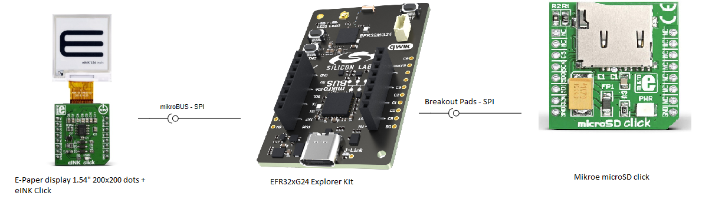
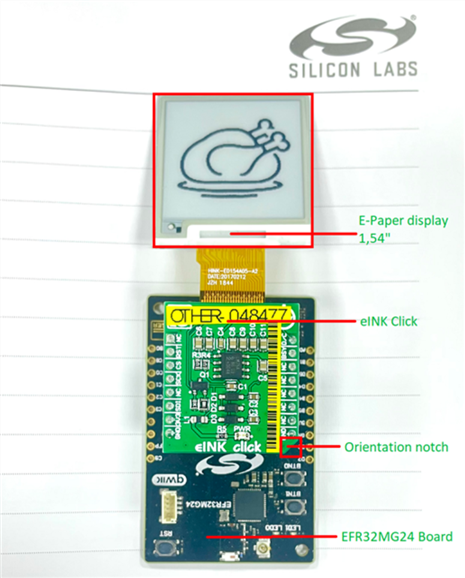
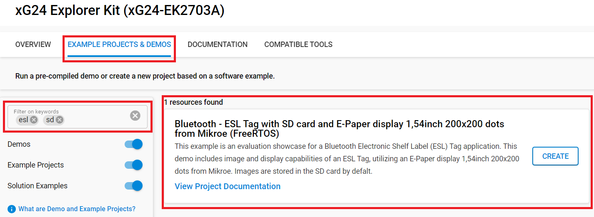
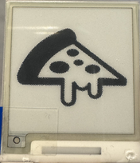

# Bluetooth - ESL Tag with SD card and E-Paper display 1,54inch 200x200 dots from Mikroe (FreeRTOS) #

## Overview ##

This project aims to show how the Bluetooth LE Electronic Shelf Label (ESL) works with the E-Paper display 1,54" 200x200 dots from Mikroe using a hardware driver via APIs of the SiSDK. The ESL tag displays the image transfered by the ESL Access Point using the E-Paper 1,54" display. The application is capable of storing two images in two different image slots at the same time. By default, the images are stored in the NVM memory.

This project is based on the [**Bluetooth - SoC ESL Tag**](https://github.com/SiliconLabs/simplicity_sdk/tree/sisdk-2024.12/app/bluetooth/example/bt_soc_esl_tag) application that can be found with documentation on GitHub and also in Simplicity Studio 5. Instead of the LCD that is on the EFR32xG24 Explorer Kit board, this project uses an E-Paper display 1,54" 200x200 dots from Mikroe to display the image. The size of the transferred images should be 200x200 pixels.

The Bluetooth LE Electronic Shelf Label documentation and the setup for the ESL network can be found in the [**AN1419: Bluetooth® LE Electronic Shelf Label**](https://www.silabs.com/documents/public/application-notes/an1419-ble-electronic-shelf-label.pdf) application note. The usage of the [**ESL Access Point**](https://github.com/SiliconLabs/simplicity_sdk/tree/sisdk-2024.12/app/bluetooth/example_host/bt_host_esl_ap/readme) is also documented at the link.

E-Paper display is based on Active Matrix Electrophoretic Display (AMEPD) technology and has an integrated pixel driver, which uses the SPI interface to communicate with the host MCU. E-Paper display has a resolution of 200(V) X 200(H) pixels and an active display area of 27.6 mm X 27.6 mm. The size of its square-shaped pixels is 0.138 mm x 0.138 mm. The screen displays clear and crisp graphics and has an ultra-wide viewing range. Another key feature of the E-Ink technology is the extremely low power consumption, even when the display actively refreshes its content.

---

## Table Of Contents ##

- [SDK version](#sdk-version)
- [Software Required](#software-required)
- [Hardware Required](#hardware-required)
- [Connections Required](#connections-required)
- [Setup](#setup)
  - [Based on an example project](#based-on-an-example-project)
  - [Start with the Bluetooth - SoC ESL Tag project](#start-with-the-bluetooth---soc-esl-tag-project)
- [How It Works](#how-it-works)
  - [Implementing ESL Tag with RTOS](#implementing-esl-tag-with-rtos)
  - [Using the application](#using-the-application)
  - [Testing](#testing)
- [Report Bugs & Get Support](#report-bugs--get-support)

---

## SDK version ##

- [Simplicity SDK v2024.12.2](https://github.com/SiliconLabs/simplicity_sdk)
- [Third Party Hardware Drivers v4.3.0](https://github.com/SiliconLabsSoftware/third_party_hw_drivers_extension)

---

## Software Required ##

- [Simplicity Studio v5 IDE](https://www.silabs.com/developers/simplicity-studio)

---

## Hardware Required ##

- 1x [xG24-EK2703A](https://www.silabs.com/development-tools/wireless/efr32xg24-explorer-kit?tab=overview) EFR32xG24 Explorer Kit
- 1x [microSD Click](https://www.mikroe.com/microsd-click)
- 1x [EINK CLICK - WITHOUT DISPLAY](https://www.mikroe.com/eink-click-without-display)
- 1x [E-Paper display 1,54" 200x200 dots](https://www.mikroe.com/e-paper-display-154-200x200-dots)

---

## Connections Required ##

### E-Paper display ###

eINK display needs an external adapter to interface with the EFR32xG24 Explorer Kit board. The hardware connection is shown in the image below:

The eINK Click needs to be connected to the EFR32xG24 Explorer Kit board via the mikroBUS socket. In the project, the pins are set as in the table below:

| eINK Click pin (Name in SS5 configurator) | EFR32xG24 Explorer Kit (BRD2703A) pin | mikroBUS pin name  |
|----------|----------|----------|
| SCK (SCLK) | PC01 | SCK |
| CS | PC00 | CS |
| SO1 (Tx) | PC03 | MOSI |
| D/C | PA0 | PWM |
| RST | PC08 | RST |
| BSY | PB01 | INT |
| GND | GND | GND |
| 3.3V | 3.3V | 3V3 |
| - (Rx) | - | - |

Different pin combinations can also be set by changing the pin configuration in the Mikroe driver components (E-Paper display 1.54" 200x200 dots (Mikroe) and mikroe SPIDRV).

This example application works with the listed explorer kits as well. The eINK Click board can be easily attached to the explorer kits via the mikrobus connector. The connected eINK Click board is shown in the image below.

### SD card ###

The SD card needs an external adapter to interface with the **EFR32xG24 Explorer Kit** board. The mikroBUS socket is already used for eINK display so the SD card is connected to the "Breadkout Pads" of the **EFR32xG24 Explorer Kit** board by using the jumper wires as in the table below.

| microSD Click (Name in SS5 configurator) | EFR32xG24 Explorer Kit (BRD2703A) pin | Breadkout Pads Number  |
| --- | --- | --- |
| SDI (Tx) | PB05 | 5 |
| SDO (Rx) | PB04 | 6 |
| SCK (CLK) | PD04 | 7 |
| CS | PD05 | 8 |
| CD | PB00 | 10 |
| +3.3V | VMCU| 4 |
| GND | GND | 3 |

---

## Setup ##

You can either create a project based on an example project or start with the "Bluetooth - SoC ESL Tag" project.

> [!NOTE]
>
> - Make sure that the [Third Party Hardware Drivers extension](https://github.com/SiliconLabs/third_party_hw_drivers_extension) is installed as part of the SiSDK and the [bluetooth_applications](https://github.com/SiliconLabs/bluetooth_applications) repository is added to [Preferences > Simplicity Studio > External Repos](https://docs.silabs.com/simplicity-studio-5-users-guide/latest/ss-5-users-guide-about-the-launcher/welcome-and-device-tabs).
>
> - SDK Extension must be enabled for the project to install the required components.

### Based on an example project ###

1. From the Launcher Home, add the BRD2703A to My Products, or connect a BRD2703A to the PC,  click on it, and click on the **EXAMPLE PROJECTS & DEMOS** tab.

2. Find the example project filtering by **esl**, **sd**. Click the **Create** button on the **Bluetooth - ESL Tag with SD card and E-Paper display 1,54inch 200x200 dots from Mikroe (FreeRTOS)** example. Example project creation dialog pops up -> click Create and Finish and Project should be generated.

   

3. Build and flash this example to the board.

### Start with the Bluetooth - SoC ESL Tag project ###

1. Create a "Bluetooth - SoC ESL Tag" project for the "EFR32xG22 4182a radio board" using Simplicity Studio v5. Use the default project settings.

2. Copy Files to Project Root:

   - Copy `app/example/bluetooth_esl_tag_mikroe_eink154_e_paper_display_sdcard_freertos/src/app.c` to the project root directory, replacing the existing app.c file.
   - Copy `app/example/bluetooth_esl_tag_mikroe_eink154_e_paper_display_sdcard_freertos/inc/esl_tag_core_config.h` to the `config` folder in the project root, overwriting the existing file.

3. Copy Folders to Project Root:

   - Copy all folders from `app/example/bluetooth_esl_tag_mikroe_eink154_e_paper_display_sdcard_freertos` into the project root directory, excluding the image, inc, and src folders.

4. Import the GATT configuration:

    - Open the .slcp file in the project.

    - Select the **CONFIGURATION TOOLS** tab and open the **Bluetooth GATT Configurator**.

    - Find the Import button and import the configuration `bluetooth_esl_tag_mikroe_eink154_e_paper_display_sdcard_freertos/config/btconfig/gatt_configuration.btconf` file.

    - Save the GATT configuration (ctrl-s).

5. Open the .slcp file. Select the **SOFTWARE COMPONENTS tab** and install the software components:

   - [Third Party Hardware Drivers] → [Display & LED] → [E-Paper Display - eINK Click (Mikroe)] → [eINK Display Resolution] → 200x200 dots
   - [Third Party Hardware Drivers] → [Storage] → [microSD - microSD Click (Mikroe)]
   - [RTOS] → [FreeRTOS] → [FreeRTOS Kernel]
   - [Platform] → [SPI] → [SPIDRV] → Instance name: mikroe
   - [Bluetooth] → [Application] → [GATT Services] → [ESL Tag NVM Image]
   - [Services] → [NVM3] → [NVM3 Default Config]
   - [Bluetooth] → [Application] → [Miscellaneous] → [ESL Tag User Defined Display Driver]

6. Uninstall the following component:

   - [Bluetooth] → [Application] → [Miscellaneous] → [ESL Tag WSTK LCD driver]

7. Configure the pins as described in the Hardware connection section.

8. Build and flash this example to the board.

> [!NOTE]
>
> A bootloader needs to be flashed to your board if the project starts from the "Bluetooth - SoC ESL Tag" project, see [Bootloader](https://github.com/SiliconLabs/bluetooth_applications/blob/master/README.md#bootloader) for more information.

---

## How It Works ##

### Implementing ESL Tag with RTOS ###

The simplicity SDK provides some components for implementing ESL Tag logic. But currently they are incompatible with RTOS. The table below describes the issues and the solutions that are applied in this project:

| Required component | Functional | Issues | Solution |
| --- | --- | --- | --- |
| app_scheduler | Handling events and scheduling tasks for execution | Implementing for bare metal, incompatible with RTOS | Re-implementing the component to be compatible with RTOS and bring it to this project |
| esl_tag_core | Implements the ESL Tag role of the Bluetooth Electronic Shelf Label Profile | Depend on app_scheduler component | Bring it to this project without any changes |
| esl_tag_display | Extends the Bluetooth Electronic Shelf Label design with display class capabilities and its corresponding ESL Display Information characteristic | Depend on esl_tag_core component | Bring it to this project without any changes |
| esl_tag_led | Extends the Bluetooth Electronic Shelf Label design with LED class capabilities and its corresponding ESL LED Information characteristic | Depend on esl_tag_core component | Bring it to this project without any changes |
| esl_tag_sensor | Extends the Bluetooth Electronic Shelf Label example design with ESL Sensor class capabilities and its corresponding ESL Sensor Information characteristic | Depend on esl_tag_core component | Bring it to this project without any changes |
| esl_tag_user_display_driver | This component provides skeleton code for a user defined display driver | Depend on esl_tag_display component | Bring it to this project and add low-level driver code for e-paper display |
| esl_tag_sdcard_image | Extends the Bluetooth Electronic Shelf Label design with image handling capabilities and associated features, including OTS image transfer capability as per ESL profile and service specifications | Not implemented yet | This is custom code based on the esl_tag_nvm_image component. It implement the image transfer logic for SD card |

### Using the application ###

After downloading and importing the project, the application has to be built in Simplicity Studio 5 and flashed to the target BRD2703A radio board.

By following the process presented in the readme file of the [**ESL Access Point**](https://github.com/SiliconLabs/simplicity_sdk/blob/sisdk-2024.12/app/bluetooth/example_host/bt_host_esl_ap/readme), the uploaded images can be displayed on the E-Paper display. There are two different image slots (0 and 1) on the ESL Tag meaning that two images can be uploaded and stored on the tag. Both of the uploaded images can be displayed on the E-Paper Display separately.

### Testing ###

The [**ESL Access Point**](https://github.com/SiliconLabs/simplicity_sdk/blob/sisdk-2024.12/app/bluetooth/example_host/bt_host_esl_ap/readme/readme.md) provides many different use cases. For instance, Windows PowerShell can be used to control the ESL Access Point.

One of the possible uses is presented below with the following command flow:

python .\app.py COM*port* --cmd → connect *BLE address* → config --full → image_update 0 image/pizza.png → sync start → disconnect → display_image *esl_id* *image_index* *display_index*

The result on the E-Paper display 1,54" should be the following:

---

## Report Bugs & Get Support ##

To report bugs in the Application Examples projects, please create a new "Issue" in the "Issues" section of [bluetooth_applications](https://github.com/SiliconLabsSoftware/bluetooth_applications) repo. Please reference the board, project, and source files associated with the bug, and reference line numbers. If you are proposing a fix, also include information on the proposed fix. Since these examples are provided as-is, there is no guarantee that these examples will be updated to fix these issues.

Questions and comments related to these examples should be made by creating a new "Issue" in the "Issues" section of [bluetooth_applications](https://github.com/SiliconLabsSoftware/bluetooth_applications) repo.

---
