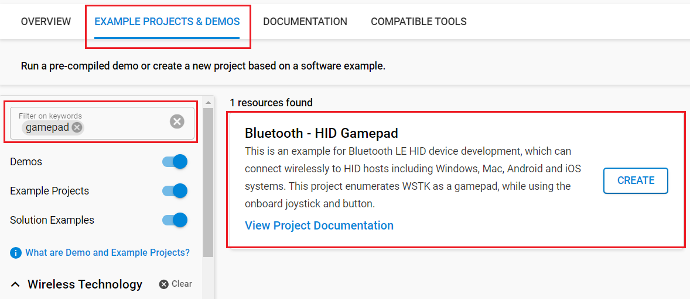

<!-- Author: Aditya Dubey -->

# Bluetooth - HID Gamepad


## Description

This project demonstrates the implementation of a Bluetooth LE Human Interface Device (HID), capable of connecting wirelessly to HID-compatible hosts such as Windows, macOS, Android, and iOS. The Bluetooth SIG defines an HID profile that enables HID services over the BLE protocol using the Generic Attribute Profile (GATT).

This example implements a joystick interface with a single button. It is compatible with standard operating systems and requires no additional drivers.

---

## Table Of Contents

- [SDK version](#sdk-version)
- [Software Required](#software-required)
- [Hardware Required](#hardware-required)
- [Connections Required](#connections-required)
- [Setup](#setup)
  - [Create a project based on an example project](#create-a-project-based-on-an-example-project)
  - [Start with a "Bluetooth - SoC Empty" project](#start-with-a-bluetooth---soc-empty-project)
- [Human Interface Device (HID) Service](#human-interface-device-hid-service)
- [How It Works](#how-it-works)
- [Conclusion](#conclusion)
- [Future Enhancements](#future-enhancements)
- [Report Bugs & Get Support](#report-bugs--get-support)

---

## SDK Version

- [Simplicity SDK v2024.12.2](https://github.com/SiliconLabs/simplicity_sdk)

---

## Software Required

- [Simplicity Studio v5 IDE](https://www.silabs.com/developers/simplicity-studio)

---

## Hardware Required

- [SLWSTK6006A - Wireless Starter Kit](https://www.silabs.com/development-tools/wireless/efr32xg21-wireless-starter-kit?tab=overview)
- [BRD4181A or BRD4181B - EFR32MG21 Radio Board](https://www.silabs.com/development-tools/wireless/slwrb4181b-efr32xg21-wireless-gecko-radio-board) (requires MB4002A main board)
- [Si-MB4002A Main Board](https://www.silabs.com/development-tools/wireless/wireless-pro-kit-mainboard?tab=overview) with on-board joystick  
  ⚠️ Note: The MB4001A does **not** include the required joystick.

---

## Connections Required

The EFR32MG21 is chosen because its GPIOs are routed to the joystick on the MB4002A. If you use the MB4001A variant, you need an external joystick connected to the expansion header.

Connect the development kit to your PC using a compatible USB cable (e.g., USB Type-C for WSTK + EFR32MG21).

---

## Setup

You can either create the project from an example or use the "Bluetooth - SoC Empty" base.

> [!NOTE]
>
> Make sure that the [bluetooth_applications](https://github.com/SiliconLabs/bluetooth_applications) repository is added to [Preferences > Simplicity Studio > External Repos](https://docs.silabs.com/simplicity-studio-5-users-guide/latest/ss-5-users-guide-about-the-launcher/welcome-and-device-tabs).

### Create a project based on an example project

1. From the Launcher Home, add your hardware to My Products, click on it, and click on the **EXAMPLE PROJECTS & DEMOS** tab. Find the example project filtering by "gamepad".
2. Click **Create** button on the **Bluetooth - HID Gamepad** example. Example project creation dialog pops up -> click Create and Finish and Project should be generated.
   
3. Build and flash this example to the board.

### Start with a "Bluetooth - SoC Empty" project

1. In Simplicity Studio 5, create a **Bluetooth - SoC Empty** project for your board.

2. Replace the contents of `src/app.c` with the provided file.

3. Import the GATT configuration:

   - Open the `.slcp` file.
   - Go to the **Configuration Tools** tab and open the **Bluetooth GATT Configurator**.
   - Click **Import** and select the provided `config/btconf/gatt_configuration.btconf`.
   - Press `Ctrl+S` to save the configuration.

4. Install required Software Components via the **SOFTWARE COMPONENTS** tab:

   - [**Services**] → [**IO Stream**] → [*IO Stream: USART*] → (default instance name: `vcom`)
   - [**Platform**] → [**Board**] → [*Board Control*] → **enable** *Virtual COM UART*
   - [**Platform**] → [**Board**] → [*Board Drivers*] → [*Joystick*]
   - [**Application**] → [**Utility**] → [*Log*]

5. Build and flash the project to your board.

> [!NOTE]
>
> - A bootloader needs to be flashed to your board if the project starts from the "Bluetooth - SoC Empty" project, see [Bootloader](https://github.com/SiliconLabs/bluetooth_applications/blob/master/README.md#bootloader) for more information.

---

## Human Interface Device (HID) Service

The HID Service enables the device to communicate with an HID host using BLE. The following characteristics are configured:

### HID Information

| Field         | Value                                                |
| ------------- | ---------------------------------------------------- |
| bcdHID        | `0x0111` (HID Class Spec 1.11)                        |
| bCountryCode  | `0x02` (Not localized, Normally Connectable)         |

### Protocol Mode

Uses the **Report Protocol** mode (`0x01`), not the Boot Protocol.

### Report Map

Defines the structure of the HID reports. Below is the 46-byte report descriptor:

```c
0x05, 0x01,        // Usage Page (Generic Desktop Ctrls)
0x09, 0x04,        // Usage (Joystick)
0xA1, 0x01,        // Collection (Application)
0x85, 0x01,        //   Report ID (1)
0x09, 0x01,        //   Usage (Pointer)
0xA1, 0x00,        //   Collection (Physical)
0x09, 0x30,        //     Usage (X)
0x09, 0x31,        //     Usage (Y)
0x15, 0x81,        //     Logical Minimum (-127)
0x25, 0x7F,        //     Logical Maximum (127)
0x75, 0x08,        //     Report Size (8)
0x95, 0x02,        //     Report Count (2)
0x81, 0x02,        //     Input (Data,Var,Abs,No Wrap,Linear,Preferred State,No Null Position)
0xC0,              //   End Collection
0x09, 0x01,        //   Usage (Pointer)
0x15, 0x00,        //   Logical Minimum (0)
0x25, 0x01,        //   Logical Maximum (1)
0x75, 0x01,        //   Report Size (1)
0x95, 0x01,        //   Report Count (1)
0x81, 0x02,        //   Input (Data,Var,Abs,No Wrap,Linear,Preferred State,No Null Position)
0x75, 0x07,        //   Report Size (7)
0x95, 0x01,        //   Report Count (1)
0x81, 0x03,        //   Input (Const,Var,Abs,No Wrap,Linear,Preferred State,No Null Position)
0xC0,              // End Collection

// 46 bytes

```

---

## Troubleshooting

If the device does not advertise or respond after flashing (e.g., no LED, not visible in Bluetooth settings, VCOM LED not glowing), you may be missing the bootloader.

### Flashing the Bootloader

1. In Simplicity Studio, create and build a `Bootloader - SoC Bluetooth Apploader OTA DFU` project suitable for your device.

2. Flash the bootloader to your board.

More information:

- [UG489 Gecko Bootloader User Guide](https://www.silabs.com/documents/public/user-guides/ug489-gecko-bootloader-user-guide-gsdk-4.pdf)  
- [AN1086: Using the Gecko Bootloader with Silicon Labs Bluetooth Applications](https://www.silabs.com/documents/public/application-notes/an1086-gecko-bootloader-bluetooth.pdf)

---

## How It Works

1. Flash both the **application** and the **bootloader** to the board.

2. Power the device and open the Bluetooth settings of your PC. Look for a device named `Gamepad`.

3. Pair with the device. It will appear in the list of connected devices.

4. Open Device Manager. Under **Human Interface Devices**, you should see an *HID-compliant game controller*.

5. Test the joystick using:
   - Windows: Run `joy.cpl`
   - Linux: Use `evtest`
     
6. Open the **Properties** window. Moving the joystick should move the `+` marker. Pressing the joystick simulates a button press.
   

## Conclusion

This project implements a BLE HID joystick with a simple 2-axis, 1-button interface. It showcases the integration of BLE HID services on Silicon Labs’ EFR32MG21 platform of Silicon Labs and serves as a solid foundation for gaming or control applications.

## Future Enhancements

- Support for multiple buttons
- Additional joystick axes
- Vibration feedback or haptic support

---

## Report Bugs & Get Support

To report bugs in the Application Examples projects, please create a new "Issue" in the "Issues" section of [bluetooth_applications](https://github.com/SiliconLabs/bluetooth_applications) repo. Please reference the board, project, and source files associated with the bug, and reference line numbers. If you are proposing a fix, also include information on the proposed fix. Since these examples are provided as-is, there is no guarantee that these examples will be updated to fix these issues.

Questions and comments related to these examples should be made by creating a new "Issue" in the "Issues" section of [bluetooth_applications](https://github.com/SiliconLabs/bluetooth_applications) repo.

---
