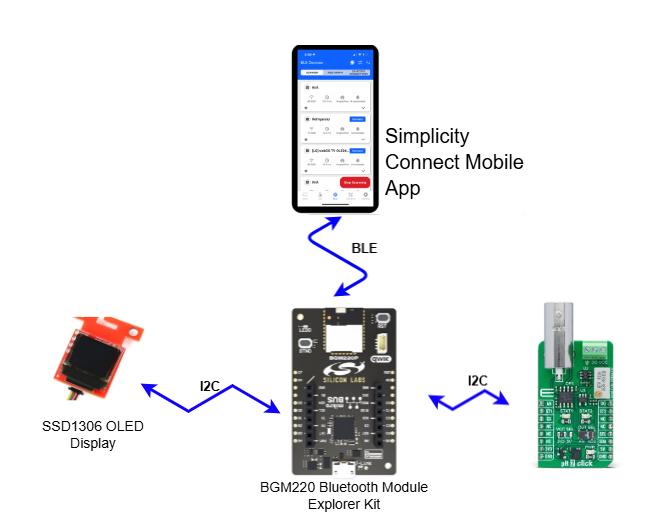
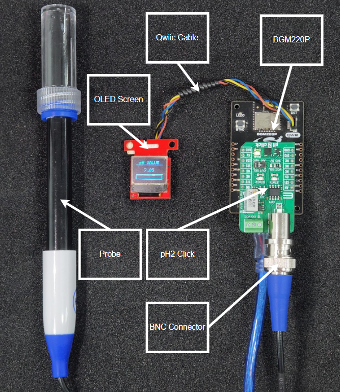
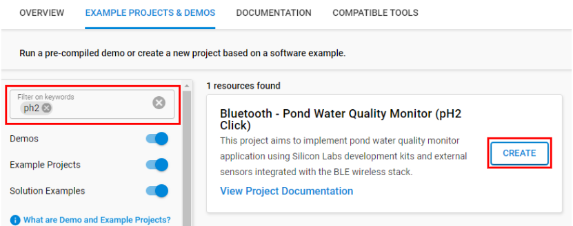
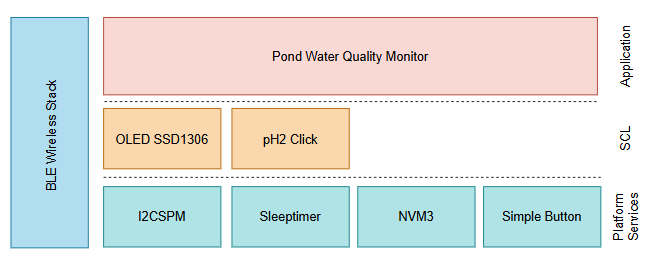
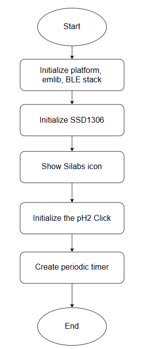
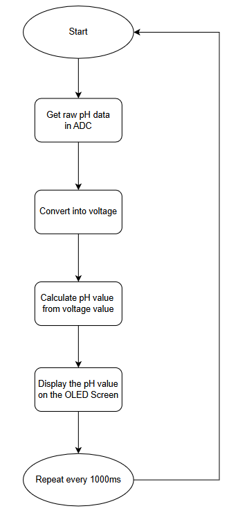
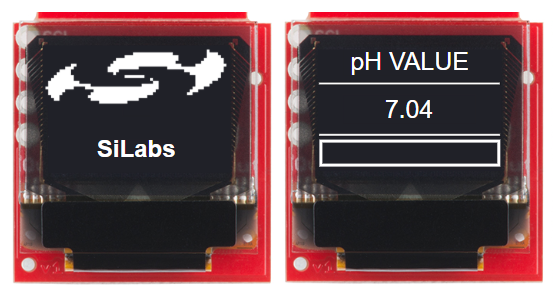
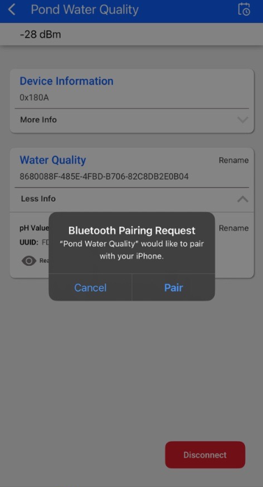
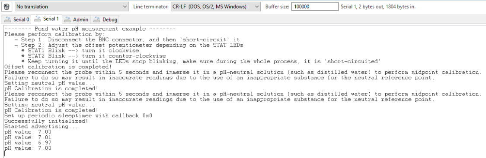

# Bluetooth - Pond Water Quality Monitor #

[%20board-green)](https://www.sparkfun.com/products/14532)

## Overview ##

This project aims to implement a pond water quality monitor system using Silicon Labs development kits and external sensors integrated with the BLE wireless stack. The block diagram of this application is shown in the image below:

More detailed information can be found in the section [How it works](#how-it-works).

This code example referred to the following code examples. More detailed information can be found here:

- [OLED SSD1306 driver](https://github.com/SiliconLabs/third_party_hw_drivers_extension/tree/master/driver/public/silabs/micro_oled_ssd1306)
- [pH2 Click driver](https://github.com/SiliconLabs/third_party_hw_drivers_extension/tree/master/driver/public/mikroe/ph2)
- [Bluetooth security feature](https://github.com/SiliconLabs/bluetooth_stack_features/tree/master/security)

---

## Table Of Contents ##

- [SDK version](#sdk-version)
- [Software Required](#software-required)
- [Hardware Required](#hardware-required)
- [Connections Required](#connections-required)
- [Setup](#setup)
  - [Based on an example project](#based-on-an-example-project)
  - [Start with a "Bluetooth - SoC Empty" project](#start-with-a-bluetooth---soc-empty-project)
- [How It Works](#how-it-works)
  - [Application Overview](#application-overview)
  - [GATT Configurator](#gatt-configurator)
  - [Pond Water Quality Monitor Implementation](#pond-water-quality-monitor-implementation)
  - [OLED Display](#oled-display)
  - [Testing](#testing)
- [Report Bugs & Get Support](#report-bugs--get-support)

---

## SDK version ##

- [SiSDK v2024.12.2](https://github.com/SiliconLabs/simplicity_sdk)
- [Third Party Hardware Drivers v4.3.0](https://github.com/SiliconLabs/third_party_hw_drivers_extension)

---

## Software Required ##

- [Simplicity Studio v5 IDE](https://www.silabs.com/developers/simplicity-studio)
- [Simplicity Connect Mobile App](https://www.silabs.com/developer-tools/simplicity-connect-mobile-app)

---

## Hardware Required ##

- 1x [Bluetooth Low Energy Explorer Kit](https://www.silabs.com/development-tools/wireless/bluetooth). For example, [BGM220-EK4314A](https://www.silabs.com/development-tools/wireless/bluetooth/bgm220-explorer-kit)
- 1x [SparkFun Micro OLED Breakout (Qwiic) board](https://www.sparkfun.com/products/14532)
- 1x [pH2 click](https://www.mikroe.com/ph-2-click)
- 1x smartphone running the 'Simplicity Connect' mobile app

---

## Connections Required ##

The hardware connection is shown in the image below:

---

## Setup ##

To test this application, you can either create a project based on an example project or start with a "Bluetooth - SoC Empty" project based on your hardware. You should connect your board to the PC using a MicroUSB cable.

> [!NOTE]
>
> - Make sure that the [Third Party Hardware Drivers extension](https://github.com/SiliconLabs/third_party_hw_drivers_extension) is installed as part of the SiSDK and the [bluetooth_applications](https://github.com/SiliconLabs/bluetooth_applications) repository is added to [Preferences > Simplicity Studio > External Repos](https://docs.silabs.com/simplicity-studio-5-users-guide/latest/ss-5-users-guide-about-the-launcher/welcome-and-device-tabs).
>
> - SDK Extension must be enabled for the project to install the required components.

### Based on an example project ###

1. From the Launcher Home, add your board to My Products, click on it, and click on the **EXAMPLE PROJECTS & DEMOS** tab. Find the example project filtering by 'pH2'.

   

2. Click **Create** button on the **Bluetooth - Pond Water Quality Monitor** example. Example project creation dialog pops up -> click Create and Finish and Project should be generated.

3. Build and flash this example to the board.

### Start with a "Bluetooth - SoC Empty" project ###

1. Create a **Bluetooth - SoC Empty** project for your hardware using Simplicity Studio 5.

2. Copy all the header files and source files in the 'inc' and 'src' folders to the root folder of the project (overwriting the existing files).

3. Open the .slcp file. Select the **SOFTWARE COMPONENTS** tab and install the software components:

   - [Services] → [Timers] → [Sleep Timer]
   - [Services] → [IO Stream] → [IO Stream: USART] → vcom
   - [Application] → [Utility] → [Log]
   - [Platform] → [Driver] → [I2C] → [I2CSPM] → qwiic
   - [Platform] → [Driver] → [I2C] → [I2CSPM] → [Add New Instances] → mikroe
   - [Platform] → [Driver] → [Button] → [Simple Button] → btn0
   - [Third Party Hardware Drivers] → [Sensors] → [pH2 Click (Mikroe)]
   - [Third Party Hardware Drivers] → [Display & LED] → [SSD1306 - Micro OLED Breakout (Sparkfun) - I2C]
   - [Third Party Hardware Drivers] → [Services] → [GLIB - OLED Graphics Library]
   - [Bluetooth] → [OTA] → [In-Place OTA DFU] → uninstall
   - [Platform] → [Bootloader Application Interface] → uninstall.

4. Import the GATT configuration:

   - Open the .slcp file in the project again.
   - Select the CONFIGURATION TOOLS tab and open the "Bluetooth GATT Configurator".
   - Find the Import button and import the [gatt_configuration.btconf](config/btconf/gatt_configuration.btconf) file.
   - Save the GATT configuration (ctrl-s).

5. Enable **Printf float**

   - Open Properties of the project.
   - Select C/C++ Build → Settings → Tool Settings → GNU ARM C Linker → General → Check **Printf float**.

     

6. Build and flash this project to the board.

---

## How it Works ##

### Application Overview ###

### GATT Configurator ###

The application is based on the Bluetooth - SoC Empty example. Since the example already has the Bluetooth GATT server, advertising, and connection mechanisms, only minor changes are required.

The GATT changes were adding a new custom service (Water Quality) using UUID `8680088F-485E-4FBD-B706-82C8DB2E0B04` which contains 1 characteristic:

- **pH Value**: UUID `FD3118AD-568D-4D88-BCE7-4B020CA25F00`

  - [**Readable**] - Get pH value from the water sources.

### Pond Water Quality Monitor Implementation ###

The Initialization software flow is as follows:

Upon receiving the sl_bt_evt_system_boot_id event, the system initializes the Security Manager to enable bonding with iOS or Android devices. Following this setup, the device begins advertising to allow connections.

The main application then proceeds with an offset calibration process. The user is prompted to disconnect the BNC connector and short-circuit the input. During this phase, the user must adjust the offset potentiometer until the STAT LEDs cease blinking. If the STAT1 LED is blinking, the potentiometer should be turned clockwise; if the STAT2 LED is blinking, it should be turned counter-clockwise.

Once the offset calibration is complete, the system performs a pH calibration. The user reconnects the BNC connector to the PH 2 Click board and immerses the probe in a neutral pH solution (typically pure water) for mid-point calibration.

A periodic timer, configured with a default interval of 1000 ms, governs the sensor sampling rate. This interval can be modified in the app.c file to accommodate more frequent sampling if required. Each time the timer elapses, an event handler is triggered to acquire and process the ADC measurement. The resulting data is then converted into a pH value and displayed on the OLED screen.

>[!NOTE]
>
> Whenever you want to recalibrate, press BTN0. The recalibration process is the same as the process in initialization step.

### OLED Display ###

Measured values are displayed on the OLED display:

- pH2

More detailed information can be found in the section [Testing](#testing).

### Testing ###

Upon reset, the application will display the Silicon Labs logo on the OLED screen for a few seconds. Then you can check the measured pH2 values on the OLED screen. You should expect a similar output to the one below.

Follow the below steps to test the example with the Simplicity Connect app:

1. Open the Simplicity Connect app on your smartphone and allow the permission requested the first time it is opened.

2. Find your device in the Bluetooth Browser, advertising as *pH Pond Quality*, and tap Connect. Then you need to accept the pairing request when connected for the first time.

   

3. Find the unknown service.

4. Try to read, write, re-read the characteristics, and check the value.

5. You can launch the Console that is integrated into Simplicity Studio or can use a third-party terminal tool like Tera Term to receive the data from the virtual COM port. Use the following UART settings: baud rate 115200, 8N1, no flow control. You should expect a similar output to the one below.

    

---

## Report Bugs & Get Support ##

To report bugs in the Application Examples projects, please create a new "Issue" in the "Issues" section of [bluetooth_applications](https://github.com/SiliconLabsSoftware/bluetooth_applications) repo. Please reference the board, project, and source files associated with the bug, and reference line numbers. If you are proposing a fix, also include information on the proposed fix. Since these examples are provided as-is, there is no guarantee that these examples will be updated to fix these issues.

Questions and comments related to these examples should be made by creating a new "Issue" in the "Issues" section of [bluetooth_applications](https://github.com/SiliconLabsSoftware/bluetooth_applications) repo.

---
