# Bluetooth - Pulse Oximeter and Heart Rate Monitor (MAX30101 & MAX32664) #

[-green)](https://www.sparkfun.com/sparkfun-micro-oled-breakout-qwiic-lcd-22495.html)

## Overview ##

This project integrates the SparkFun Pulse Oximeter and Heart Rate Sensor (MAX30101 & MAX32664, Qwiic) with the Silicon Labs EFR32xG24 Explorer Kit, the BUZZ 2 Click, and the SparkFun Micro OLED Breakout (Qwiic). The system continuously monitors blood oxygen saturation (SpO₂), heart rate, and sensor confidence, and provides local visualization on the OLED as well as wireless access via standard BLE services.

The design is well-suited for wearable or portable health monitoring applications, and it extends functionality with robust data reporting, confidence metrics, and error/finger detection status indicators.

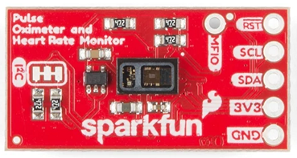

The SparkFun MAX30101 & MAX32664 board is a compact development platform that contains the MAX30101 pulse oximeter and heart-rate sensor and a MAX32664 microcontroller pre-flashed with firmware to process sensor data. The microcontroller acts as a sensor hub and communicates with the sensor over a separate I2C bus. The sensor hub gathers and processes the measurement data.

The MAX30101 sensor uses red and infrared LEDs and a photodetector to measure blood oxygen saturation (SpO₂) and heart rate. This sensor board is designed to simplify the process of reading, interpreting and communicating the sensor data. It eliminates the need for additional microcontroller programming. The board also includes an I2C interface for communication with other devices. This sensor board is ideal for a wide range of applications, such as medical monitoring, sports and fitness tracking, sleep analysis, and portable or wearable devices.

---

## Table Of Contents ##

- [SDK version](#sdk-version)
- [Software Required](#software-required)
- [Hardware Required](#hardware-required)
- [Connections Required](#connections-required)
- [Setup](#setup)
  - [Create a project based on an example project](#create-a-project-based-on-an-example-project)
  - [Start with a "Bluetooth - SoC Empty" project](#start-with-a-bluetooth---soc-empty-project)
- [How It Works](#how-it-works)
- [Testing](#testing)
- [Report Bugs & Get Support](#report-bugs--get-support)

---

## SDK version ##

- [Simplicity SDK v2025.6.2](https://github.com/SiliconLabs/simplicity_sdk/releases/tag/v2025.6.2)

---

## Software Required ##

- [Simplicity Studio v5 IDE](https://www.silabs.com/developers/simplicity-studio)
- [Simplicity Connect Mobile App](https://www.silabs.com/developer-tools/simplicity-connect-mobile-app)

---

## Hardware Required ##

- 1x [EFR32xG24 Explorer Kit](https://www.silabs.com/development-tools/wireless/efr32xg24-explorer-kit?tab=overview) 
- 1x [SparkFun Pulse Oximeter and Heart Rate Sensor - MAX30101 & MAX32664 (Qwiic)](https://www.sparkfun.com/sparkfun-pulse-oximeter-and-heart-rate-sensor-max30101-max32664-qwiic.html)
- 1x [SparkFun Micro OLED Breakout (Qwiic)](https://www.sparkfun.com/sparkfun-micro-oled-breakout-qwiic-lcd-22495.html)
- 1x [BUZZ 2 Click](https://www.mikroe.com/buzz-2-click)
- 1x Smartphone running the Simplicity Connect Mobile App

---

## Connections Required ##

The Silicon Labs Explorer Kit boards feature a mikroBUS™ socket, allowing the Buzz 2 Click board to connect easily via the mikroBUS header. Ensure that the 45-degree corner of the Buzz 2 Click board aligns with the 45-degree white line on the Explorer Kit. The SparkFun Pulse Oximeter & Heart Rate Sensor and the SparkFun Micro OLED Breakout can be connected in series and attached to the Explorer Kit via the Qwiic connector. Finally, connect the Explorer Kit to a computer using a USB Type-C cable. The hardware connection is illustrated in the image below.

  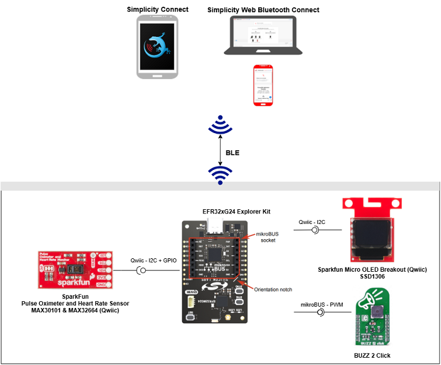

---

## Setup ##

To test this application, you can either create a project based on the provided example, or start with a "Bluetooth - SoC Empty" project for your hardware.

> [!NOTE]
>
> Add the [bluetooth_applications](https://github.com/SiliconLabsSoftware/bluetooth_applications) repository under [Preferences > Simplicity Studio > External Repos](https://docs.silabs.com/simplicity-studio-5-users-guide/latest/ss-5-users-guide-about-the-launcher/welcome-and-device-tabs).

### Create a project based on an example project ###

1. From the Launcher Home, add your hardware to My Products, click on it, and click on the **EXAMPLE PROJECTS & DEMOS** tab. Find the example project by filtering for "bluetooth-pulse oximeter".

2. Click the **Create** button for the **Bluetooth - Pulse Oximeter and Heart Rate Monitor (MAX30101 - MAX32664)** example. When the project creation dialog appears, click **Create** and then **Finish**. The project will be generated.

   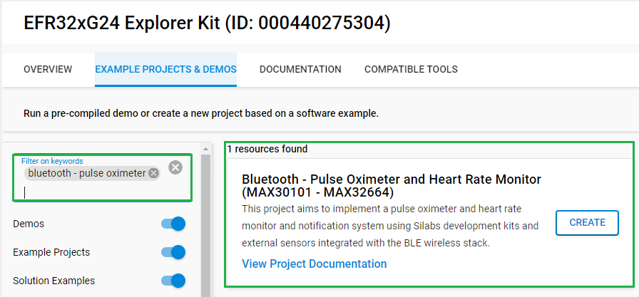

3. Build and flash this example to the board.

### Start with a "Bluetooth - SoC Empty" project ###

1. Create a **Bluetooth - SoC Empty** project for your hardware using Simplicity Studio 5.

2. Copy all attached files from the *inc*, *src*, and *config* folders into the project root directory, overwriting existing files as needed.

3. Import the GATT configuration:

   - Open the *.slcp file in the project.

   - Select the **CONFIGURATION TOOLS** tab and open the **Bluetooth GATT Configurator**.

   - Find the Import button and import the attached `config/gatt_configuration.btconf` file.

   - Save the GATT configuration (Ctrl+S).

4. Open the *.slcp file. Select the SOFTWARE COMPONENTS tab, and install the following software components:

   - [Services] → [IO Stream] → [IO Stream: EUSART] → default instance name: vcom
   - [Application] → [Utility] → [Log]
   - [Platform] → [Driver] → [I2C] → [I2CSPM] → default instance name: qwiic
   - [Third Party Hardware Drivers] → [Display & LED] → [SSD1306 - Micro OLED Breakout (Sparkfun) - I2C] → use default configuration
   - [Third Party Hardware Drivers] → [Services] → [GLIB - OLED Graphics Library]
   - [Third Party Hardware Drivers] → [Sensors] → [MAX30101 & MAX32664 - Pulse Oximeter and Heart Rate Sensor (Sparkfun)] → use default configuration
   - [Third Party Hardware Drivers] → [Mikroe Click] → [Audio & Voice] → [CMT-8540S-SMT - Buzz 2 Click (Mikroe)]
   - [Bluetooth] → [Bluetooth Host (Stack)] → [Additional Features] → [NVM Support]

5. Build and flash the project to your device.

> [!NOTE]
>
> A bootloader needs to be flashed to your board. See [Bootloader](https://github.com/SiliconLabs/bluetooth_applications/blob/master/README.md#bootloader) for more information.

---

## How It Works ##

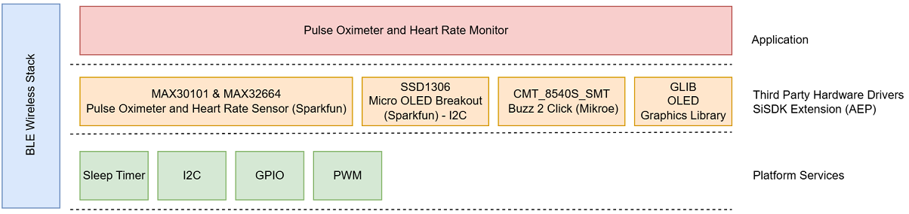

At startup, the program initializes the platform and BLE stack, retrieves configuration settings from non-volatile memory (NVM), and sets up the OLED display (showing the Silabs logo). The buzzer and sensor are then configured according to the loaded settings. A periodic timer sets the sampling interval (default: 500 ms). The program collects SpO₂ and heart rate readings, sends them to the BLE client, and displays them on the OLED screen. It also checks measurements against user-defined thresholds in NVM to determine alarm status.

| Software Initialization | Software Main Process| Software Alarm Process|
| ------------- | ------------- | ------------- |
| 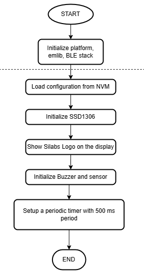  | 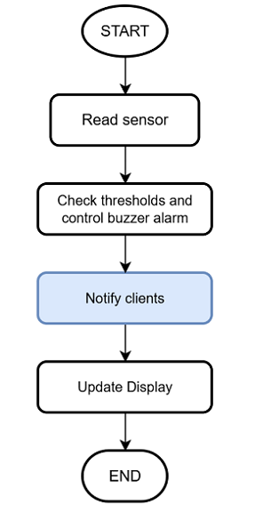 | 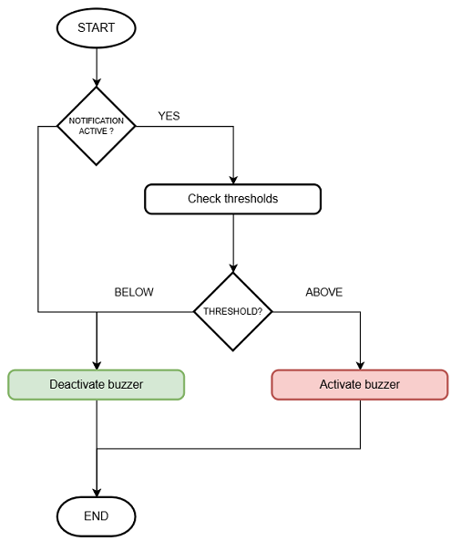 |

---

## Testing ##

Follow the steps below to test the example:

1. Build and flash the "Bluetooth - Pulse Oximeter and Heart Rate Monitor (MAX30101 - MAX32664)" application to your device.
2. Open the Simplicity Connect mobile application on your smartphone. Go to the "Scan" tab and press "Connect" on the "POM & HR Monitor" device. In the "Threshold and Settings" service, "WRITE" configuration values for the following fields: buzzer volume (1-10), alarm enable (1 or 0), SpO₂ threshold, low heart rate threshold, and high heart rate threshold. After that, the user must enable notification for the "PLX Continuous Measurement" field in the "Pulse Oximeter Service", "Heart Rate Measurement" field in the "Heart Rate Service" and the "Alarm Status" field in the "Threshold and Settings" service.

   | Write The Configuration Data | Enable Notification |
   | ------------- | ------------- |
   | 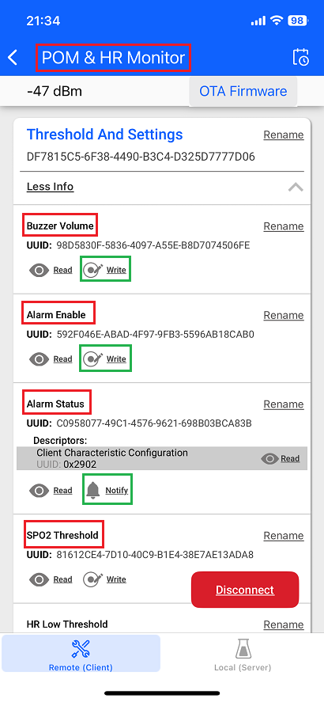  | 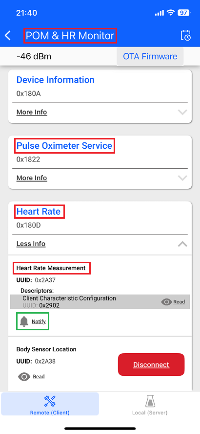 |

3. Place your finger gently on the sensor, without optical leakage and avoid excessive force. Check your heart rate and SpO₂ data on the OLED screen and in the Simplicity Connect mobile application. If the alarm is enabled and one or more thresholds are triggered, then the application will activate the buzzer, show the buzzer icon, and the trigger source will have an inverted blinking background on the OLED screen.

   | No Finger Detected | Release Pressure | Alarm Activated |
   | ------------- | ------------- | ------------- |
   | 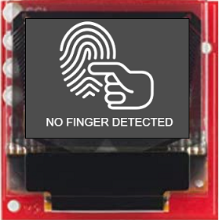  | 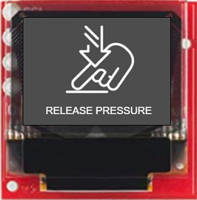 | 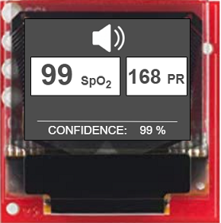 |

4. You can launch the Console integrated into Simplicity Studio or use a third-party terminal tool like "Tera Term" to receive logs from the virtual COM port.

   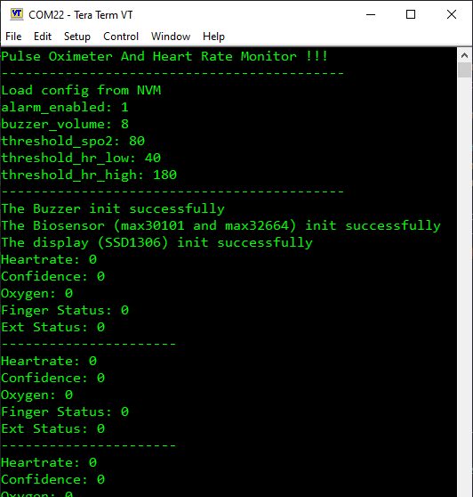

---

## Report Bugs & Get Support ##

To report bugs in the Application Examples projects, please create a new "Issue" in the "Issues" section of the [bluetooth_applications](https://github.com/SiliconLabsSoftware/bluetooth_applications) repository. Reference the board, project, and relevant source files (with line numbers). If you are proposing a fix, please include details about the solution. Note: These examples are provided as-is, and there is no guarantee they will be updated.

Questions and comments related to these examples should also be submitted as issues in the [bluetooth_applications](https://github.com/SiliconLabsSoftware/bluetooth_applications) repository.

---
