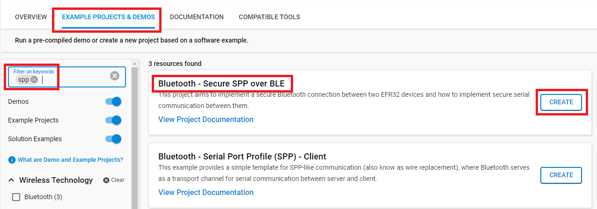
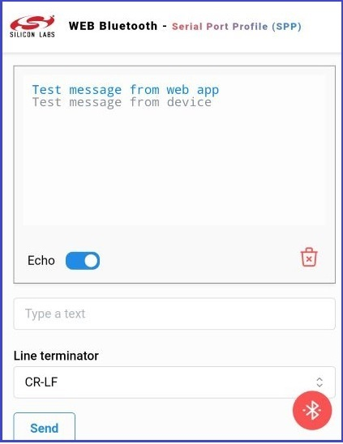
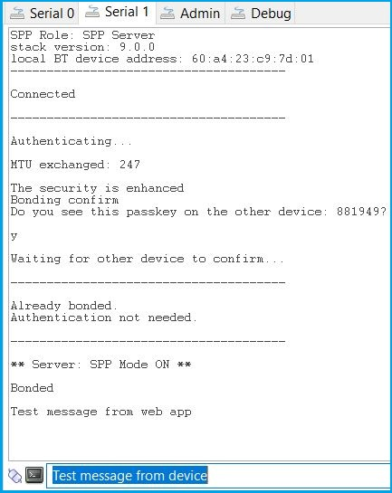

# Bluetooth - Secure SPP (Serial Port Profile) over BLE

## Background

This code example has a related User's Guide, here: [Using Bluetooth Security Features](https://docs.silabs.com/bluetooth/latest/general/security/using-bluetooth-security-features-in-silicon-labs-bluetooth-sdk).

## Description

This code example demonstrates how to build a secure Bluetooth connection between two EFR32 devices and how to implement secure serial communication between them. The example relies on the [Bluetooth - Serial Port Profile (SPP)](https://github.com/SiliconLabs/bluetooth_applications/tree/master/bluetooth_serial_port_profile) example which implements the serial communication between the two devices. See the SPP example first to understand how it works. This example puts emphasis on the security side.

Just like with [Bluetooth - Serial Port Profile (SPP)](https://github.com/SiliconLabs/bluetooth_applications/tree/master/bluetooth_serial_port_profile), the client and server roles are combined into one code. Upload the same code to both devices that you want to connect. The roles are configured by holding down either pushbutton at boot time. Holding down the button makes that device a central (client), which is scanning for other devices that implements the SPP service. If none of the buttons is held down during reset, the device becomes a peripherial (server) and starts advertising.

When the connection is built and services and characteristics are discovered, the devices have to go through an authentication phase before starting secure data transfer. In this example, I/O capabilities are defined to DisplayYesNo, which ultimately results in a Numeric Comparison pairing method. For details, see the description of [Pairing Processes](https://docs.silabs.com/bluetooth/latest/general/security/pairing-processes).

During the authentication phase, the devices have to confirm that they have successfully built a secure connection by showing passkeys on both devices. If the passkeys match and both devices confirm it, they are bonded (paired). If the devices were already bonded when they connected, the authentication is not needed again and the secure connection is automatically built using the long term key stored in the flash.

Bonding information including the long term key and other information persists over reset. To test the authentication repeatedly, implement a call to **sm_delete_bondings** with a trigger of your choice. Another option is to use the Simplicity Commander tool to erase the flash of the device.

> [!NOTE]
> We have implemented the **client-side device** as an example how to communicate with Silicon Labs wireless microcontrollers using the BLE protocol from [compatible browsers](https://developer.mozilla.org/en-US/docs/Web/API/Web_Bluetooth_API#browser_compatibility) with the Web Bluetooth API. You can check out the source code here: [web-bluetooth-spp-application](https://github.com/SiliconLabsSoftware/web-bluetooth-spp-application) and follow the instructions to run it locally. Alternatively, you can use the live demo online at [https://siliconlabssoftware.github.io/web-bluetooth-spp-application/](https://siliconlabssoftware.github.io/web-bluetooth-spp-application/). A detailed guide on how to use the live demo with the server-side of this application example is also provided in the [Test with Web App](#test-with-web-app) section.

---

## Table of Contents

- [Description](#description)
- [SDK version](#sdk-version)
- [Hardware Required](#hardware-required)
- [Software Required](#software-required)
- [Connections Required](#connections-required)
- [Setup](#setup)
  - [Create a project based on an example project](#create-a-project-based-on-an-example-project)
  - [Start with a "Bluetooth - SoC Empty" project](#start-with-a-bluetooth---soc-empty-project)
- [How It Works](#how-it-works)
  - [Test with 2 EFR boards](#test-with-2-efr-boards)
  - [Test with Web App](#test-with-web-app)
- [Report Bugs & Get Support](#report-bugs--get-support)

---

## SDK version

- [Simplicity SDK v2024.12.2](https://github.com/SiliconLabs/simplicity_sdk)

## Software Required

- [Simplicity Studio v5 IDE](https://www.silabs.com/developers/simplicity-studio)
- [Web Bluetooth SPP Application](https://siliconlabssoftware.github.io/web-bluetooth-spp-application/)

## Hardware Required

- 2x [Bluetooth Low Energy Development Kit](https://www.silabs.com/development-tools/wireless/bluetooth). For simplicity, Silicon Labs recommends the [BGM220-EK4314A](https://www.silabs.com/development-tools/wireless/bluetooth/bgm220-explorer-kit)

## Connections Required

- Connect the Bluetooth Development Kits to the PC through a compatible-cable. For example, a micro USB cable for the BGM220 Bluetooth Module Explorer Kit.

## Setup

To test this application, you can either create a project based on an example project or start with a "Bluetooth - SoC Empty" project based on your hardware.

> [!NOTE]
>
> Make sure that the [bluetooth_applications](https://github.com/SiliconLabs/bluetooth_applications) repository is added to [Preferences > Simplicity Studio > External Repos](https://docs.silabs.com/simplicity-studio-5-users-guide/latest/ss-5-users-guide-about-the-launcher/welcome-and-device-tabs).

### Create a project based on an example project

1. From the Launcher Home, add your hardware to My Products, click on it, and click on the **EXAMPLE PROJECTS & DEMOS** tab. Find the example project filtering by "secure".

2. Click **Create** button on the **Bluetooth - Secure SPP over BLE** examples. Example project creation dialog pops up -> click Create and Finish and Project should be generated.

3. Build and flash this example to the board.

### Start with a "Bluetooth - SoC Empty" project

1. Create a **Bluetooth - SoC Empty** project for your hardware using Simplicity Studio 5.

2. Copy all attached files in inc and src folders into the project root folder (overwriting existing file).

3. Open the .slcp file. Select the **SOFTWARE COMPONENTS tab** and install the software components:

   - [Services] → [IO Stream] → [IO Stream: USART] → default instance name: vcom
     
   - [Platform] → [Board] → [Board Control] → enable *Virtual COM UART*
   - [Application] → [Utility] → [Log]
     
   - [Platform] → [Driver] → [Button] → [Simple Button] → btn0
     

4. Import the GATT configuration:

   - Open the **Bluetooth GATT Configurator** under the **CONFIGURATION TOOLS** tab.
   - Find the Import button and import the attached **gatt_configuration.btconf** file.
     
   - Save the GATT configuration (Ctrl+S).

5. Build and flash the project to each device.

> [!NOTE]
>
> A bootloader needs to be flashed to your board if the project starts from the "Bluetooth - SoC Empty" project, see [Bootloader](https://github.com/SiliconLabs/bluetooth_applications/blob/master/README.md#bootloader) for more information.

## How It Works

### Test with 2 EFR boards

1. Open a terminal program (e.g., Tera Term) and connect to both devices to see the logs.

2. Press PB0 or PB1 on one of the devices while resetting it to put it into client mode.

3. Simply reset the other device to put it into server mode.

4. After the first boot, the authentication phase requires confirmation that the passkeys displayed on the two devices match. To confirm, send a 'y' or 'Y' character with the terminal. To decline send 'n' or 'N'.

5. After the authentication phase, use the application to send characters from one device to the other just like with the [Bluetooth - Serial Port Profile (SPP)](https://github.com/SiliconLabs/bluetooth_applications/tree/master/bluetooth_serial_port_profile) example.

   

6. Reboot the devices and check if the secure connection is built automatically.

7. Open the Network Analyzer, connect to one of the devices, and check its traffic. You should see encrypted content.

> [!NOTE]
>
> To get a proper log, Network Analyzer needs to observe the connection from the very beginning. Hence, after connecting to your device, reset it, and let the Network Analyzer observe the connection establishment process.
>
> 

### Test with Web App

1. Open a terminal program (e.g., Tera Term) and connect to server device to see the logs. Since the default configuration is server mode, you don't need to do anything else.

2. Open the live demo online at [https://siliconlabssoftware.github.io/web-bluetooth-spp-application/](https://siliconlabssoftware.github.io/web-bluetooth-spp-application/) on a supported browser.

3. From the web browser, press the connect button and choose the server device to pair. Allow the Bluetooth pairing on both the server and the client devices. After the devices successfully connected, it is possible to send messages between the web app client and server devices.

   | ||
   |:-:|:-:|
   | **Web App** | **Server Device** |

---

## Report Bugs & Get Support

To report bugs in the Application Examples projects, please create a new "Issue" in the "Issues" section of [bluetooth_applications](https://github.com/SiliconLabs/bluetooth_applications) repo. Please reference the board, project, and source files associated with the bug, and reference line numbers. If you are proposing a fix, also include information on the proposed fix. Since these examples are provided as-is, there is no guarantee that these examples will be updated to fix these issues.

Questions and comments related to these examples should be made by creating a new "Issue" in the "Issues" section of [bluetooth_applications](https://github.com/SiliconLabs/bluetooth_applications) repo.

---
