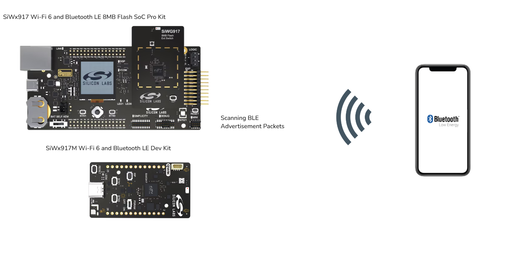
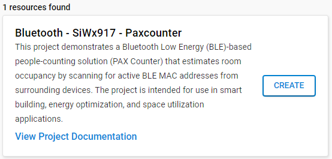
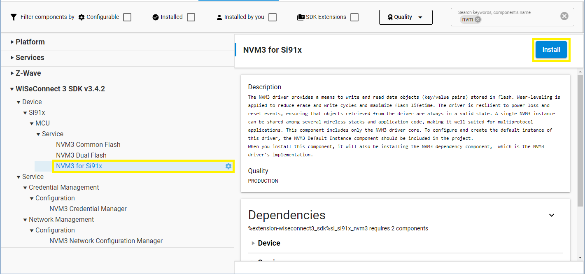
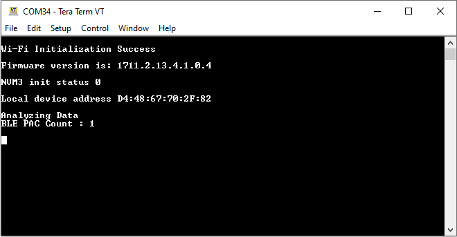

# Bluetooth - SiWx917 - Paxcounter


## Purpose and Scope

This project demonstrates a Bluetooth Low Energy (BLE)-based people-counting solution (PAX Counter) that estimates room occupancy by scanning for active BLE MAC addresses from surrounding devices. The project is intended for use in smart building, energy optimization, and space utilization applications.

---

## Table of Contents

- [Purpose and Scope](#purpose-and-scope)
- [Overview](#overview)
  - [System Overview](#system-overview)
  - [Application Overview](#application-overview)
- [Hardware Requirements](#hardware-requirements)
- [Software Requirements](#software-requirements)
- [Setup](#setup)
- [Application Configurations](#application-configurations)  
- [How It Works](#how-it-works)
- [Note](#note)
- [Report Bugs & Get Support](#report-bugs--get-support)

---

## Overview

### System Overview

The BLE PAX Counter operates by passively scanning for BLE beacons from nearby devices (e.g., smartphones, headphones, wearables). The system detects and logs MAC addresses and monitors how long each MAC remains visible. This occupancy time is used to infer room occupancy over time.



### Application Overview

- **Device Initialization:**  
  Initializes BLE scanning functionality.

- **BLE MAC Logging:**  
  Captures advertisement packets, extracts MAC addresses, and logs timestamps.

- **Occupancy Estimation Logic:**  
  Tracks unique MAC addresses and their occupancy times to estimate the number of individuals present in a room.

- **Optional Output Modes:**  
  Data can be displayed on serial console via UART.

---

## SDK version

- [Simplicity SDK v2024.12.2](https://github.com/SiliconLabs/simplicity_sdk)

## Hardware Requirements

- SoC Model:
  - Standalone
    - [Si-MB4002A - Wireless pro kit mainboard](https://www.silabs.com/development-tools/wireless/wireless-pro-kit-mainboard?tab=overview)
    - [SiWx917-RB4338A - SiWx917 Wi-Fi 6 and Bluetooth LE SoC 8 MB Flash Radio Board](https://www.silabs.com/development-tools/wireless/wi-fi/siwx917-rb4338a-wifi-6-bluetooth-le-soc-radio-board?tab=overview)
  - Kits
    - [SiWx917-PK6031A - SiWx917 Wi-Fi 6 and Bluetooth LE 8 MB Flash SoC Pro Kit](https://www.silabs.com/development-tools/wireless/wi-fi/siwx917-pro-kit?tab=overview)

    OR
    - [SiWx917-DK2605A - SiWx917M Wi-Fi 6 and Bluetooth LE Dev Kit](https://www.silabs.com/development-tools/wireless/wi-fi/siwx917-dk2605a-wifi-6-bluetooth-le-soc-dev-kit?tab=overview)

- USB cable
- PC with terminal software (e.g., Tera Term or PuTTY)

---

## Software Requirements

- Simplicity Studio
  - Download the [Simplicity Studio v5 IDE](https://www.silabs.com/developers/simplicity-studio)
  - Follow the [Simplicity Studio User Guide](https://docs.silabs.com/simplicity-studio-5-users-guide/1.1.0/ss-5-users-guide-getting-started/install-ss-5-and-software#install-ssv5) to install Simplicity Studio IDE
- [Simplicity SDK Version 2024.12.2](https://github.com/SiliconLabs/simplicity_sdk/releases/tag/v2024.12.2)
- [WiSeConnect 3 SDK extension version 3.4.2](https://github.com/SiliconLabs/wiseconnect/releases/tag/v3.4.2)

> NOTE:
>
> The project has been only built and tested with [Simplicity SDK Version 2024.12.2](https://github.com/SiliconLabs/simplicity_sdk/releases/tag/v2024.12.2) and [WiSeConnect 3 SDK extension version 3.4.2](https://github.com/SiliconLabs/wiseconnect/releases/tag/v3.4.2).

---

## Setup

### Connections Required

Connect the **SiWx917 Wi-Fi 6 and Bluetooth LE 8 MB Flash SoC Pro Kit** or the **SiWx917M Wi-Fi 6 and Bluetooth LE Dev Kit** to the PC through a USB type C cable. To test this application, you can either create a project based on an example project or start with a " BLE - Central (SoC)" project.

### Create a project based on an example project

1. From the Launcher Home, add your board to My Products, click on it, and click on the **EXAMPLE PROJECTS & DEMOS** tab. Find the example project filtering by "PAX COUNTER".

2. Click **Create** button on the **Bluetooth - SiWx917 - Paxcounter** example. Example project creation dialog pops up -> click Create and Finish and Project should be generated.

   

3. Build and flash this example to the board.

### Create a project based on the BLE - Central (SoC) project

1. Create the BLE - Central (SoC) project for the SiWx917 in Simplicity Studio.

2. Copy all the files in the `bluetooth_siwx917_paxcounter/inc` and `bluetooth_siwx917_paxcounter/src` folder into the project folder, overwriting the existing files.

3. Open the *.slcp file. Select the **SOFTWARE COMPONENTS tab** and install the software component:

   - [WiSeConnect 3 SDK v3.4.2] → [Device] → [Si91x] → [MCU] → [Service] → [NVM3 for Si91x]
     

4. Build and flash the project onto the board.

## Application Configurations

The BLE PAX Counter can be fine-tuned using the following parameters defined in the application code:

- **OCCUPANCY_TIMEOUT_MS**  
  Time in **milliseconds** before a MAC address is considered to have "left the room." If a MAC hasn't been seen within this timeout, it is removed from the active list.

  ```c
    #define OCCUPANCY_TIMEOUT_MS  60000  // 60 seconds   
  ```

- **RSSI_THRESHOLD:**
  Signal strength threshold (in dBm) used to filter out distant or weak devices. Only devices with RSSI above this value are considered for occupancy estimation.

  ```c
    #define RSSI_THRESHOLD        -50    // in dBm
  ```

- **PAX_UPDATE_TIMEOUT:**
  Time in milliseconds to perform periodic PAX (occupancy) analysis and output the current count. This governs how often the occupancy value is refreshed and reported.

  ```c
    #define PAX_UPDATE_TIMEOUT    5000   // 5 seconds 
  ```

  These values can be adjusted based on the environment and use case (e.g., small room vs. large hall, presence of walls, etc.).

---

## How It Works

After flashing the code to the board, the application starts running automatically. Using Putty/Tera Term (or another program) to read the values of the serial output is advised. Note that the board uses the default baud rate of 115200.

- After initialization. The BLE scanning begins automatically.

- Devices advertising over BLE are detected and their MAC addresses are logged using NVM.

- Each MAC is tracked and their last seen time stamp is updated.

- MACs present is counted as individuals and if a MAC hasn't been seen within OCCUPANCY_TIMEOUT_MS, it is removed from the active list.

- Total occupancy is printed to the serial console every configured interval.

  

---

## Note

### Known Limitations and Drawbacks

#### BLE MAC Address ≠ Person

A person may carry multiple BLE devices (smartphone, smartwatch, earbuds), inflating counts.

#### No Device = No Detection

Individuals without any BLE devices, or with Bluetooth turned off, won’t be counted — leading to underestimation.

#### MAC Address Churn and Randomization

Many modern devices frequently change their BLE MAC address (MAC randomization) as a privacy feature. This may:

- Result in **over-counting** if new randomized MACs are treated as unique devices

---

## Report Bugs & Get Support

To report bugs in the Application Examples projects, please create a new "Issue" in the "Issues" section of [bluetooth_applications](https://github.com/SiliconLabs/bluetooth_applications) repo. Please reference the board, project, and source files associated with the bug, and reference line numbers. If you are proposing a fix, also include information on the proposed fix. Since these examples are provided as-is, there is no guarantee that these examples will be updated to fix these issues.

Questions and comments related to these examples should be made by creating a new "Issue" in the "Issues" section of [bluetooth_applications](https://github.com/SiliconLabs/bluetooth_applications) repo.

---
