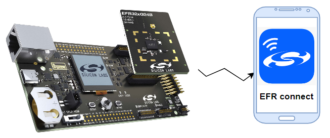
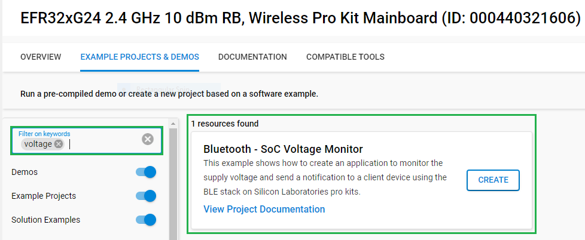
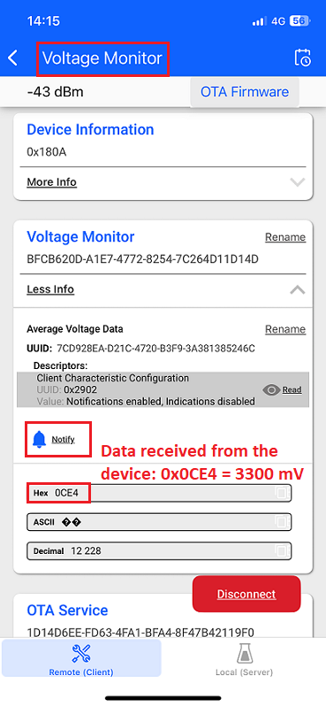
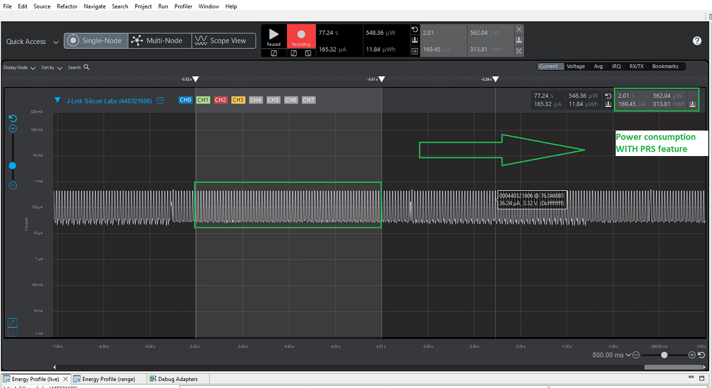
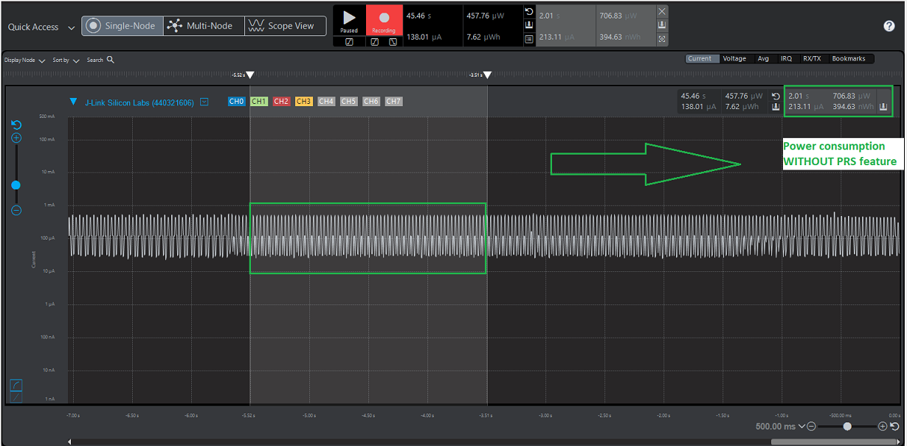

# Bluetooth - SoC Voltage Monitor #

## Overview ##

Maximizing energy efficiency is crucial for battery-powered IoT applications, where even small reductions in current consumption can significantly extend battery life. Silicon Labs EFR devices offer several strategies to minimize power usage across a wide range of applications. One effective approach is to keep the CPU in sleep mode as much as possible by offloading tasks to dedicated hardware peripherals. Instead of relying on the CPU to manage every operation, developers should focus on configuring hardware modules to perform most tasks, stepping in with software only when necessary. This strategy ensures that hardware handles the majority of the workload, making the application more efficient. The main objectives are to achieve the deepest possible sleep states and reduce how often the system needs to wake up.

EFR32 devices feature a Peripheral Reflex System (PRS) with configurable logic that enables combinations of functions between channels. The PRS is a signal routing network that allows different peripheral modules to communicate directly with each other, without involving the CPU. Peripherals that generate reflex signals are called producers, while those that receive signals are called consumers. The PRS efficiently routes signals from producer to consumer peripherals. This project aims to demonstrate how the PRS can be used to optimize energy efficiency.

---

## Table Of Contents ##

- [SDK version](#sdk-version)
- [Software Required](#software-required)
- [Hardware Required](#hardware-required)
- [Connections Required](#connections-required)
- [Setup](#setup)
  - [Create a project based on an example project](#create-a-project-based-on-an-example-project)
  - [Start with a "Bluetooth - SoC Empty" project](#start-with-a-bluetooth---soc-empty-project)
- [How It Works](#how-it-works)
- [Testing](#testing)
- [Report Bugs & Get Support](#report-bugs--get-support)

---

## SDK version ##

- [SiSDK v2025.6.0](https://github.com/SiliconLabs/simplicity_sdk/releases/tag/v2025.6.0)

---

## Software Required ##

- [Simplicity Studio v5 IDE](https://www.silabs.com/developers/simplicity-studio)
- [Simplicity Connect Mobile App](https://www.silabs.com/developer-tools/simplicity-connect-mobile-app)

---

## Hardware Required ##

- 1x [EFR32xG24 Pro Kit](https://www.silabs.com/development-tools/wireless/efr32xg24-pro-kit-10-dbm?tab=overview) 
- 1x Smartphone running the Simplicity Connect Mobile App

  

---

## Connections Required ##

To run this example the user should connect the EFR32xG24 Wireless Radio Board to the Wireless Pro Kit Mainboard, and then connect the board to the laptop or PC using a USB Type-C cable.

---

## Setup ##

To test this application, you can either create a project based on an example project or start with a "Bluetooth - SoC Empty" project based on your hardware.

> [!NOTE]
>
> Make sure that the [bluetooth_applications](https://github.com/SiliconLabsSoftware/bluetooth_applications) repository is added to [Preferences > Simplicity Studio > External Repos](https://docs.silabs.com/simplicity-studio-5-users-guide/latest/ss-5-users-guide-about-the-launcher/welcome-and-device-tabs).

### Create a project based on an example project ###

1. From the Launcher Home, add your hardware to My Products, click on it, and click on the **EXAMPLE PROJECTS & DEMOS** tab. Find the example project filtering by "voltage".

2. Click the **Create** button for the **Bluetooth - SoC Voltage Monitor** example. When the project creation dialog appears, click **Create** and then **Finish**. The project will be generated.

   

3. Build and flash this example to the board.

### Start with a "Bluetooth - SoC Empty" project ###

1. Create a **Bluetooth - SoC Empty** project for your hardware using Simplicity Studio 5.

2. Copy all attached files in the *inc*, *src*, and *config* folders into the project root folder (overwriting existing files).

3. Import the GATT configuration:

   - Open the *.slcp file in the project.

   - Select the **CONFIGURATION TOOLS** tab and open the **Bluetooth GATT Configurator**.

   - Find the Import button and import the attached `config/gatt_configuration.btconf` file.

   - Save the GATT configuration (Ctrl+S).

4. Open the *.slcp file. Select the SOFTWARE COMPONENTS tab, and install the following software components:

   - [Platform] → [Peripheral] → [EMLIB] → [IADC]
   - [Platform] → [Peripheral] → [EMLIB] → [LETIMER]
   - [Platform] → [Driver] → [Button] → [Simple Button] → btn0

5. Build and flash the project to your device.

> [!NOTE]
>
> A bootloader needs to be flashed to your board, see [Bootloader](https://github.com/SiliconLabs/bluetooth_applications/blob/master/README.md#bootloader) for more information.

---

## How It Works ##

- After startup, the program will begin automatically. First, it initializes peripheral drivers such as clocks, the low-energy timer, IADC, LDMA, and PRS. Next, the program advertises itself via BLE as “Voltage Monitor.” The user can use the Simplicity Connect application to pair with this device. After receiving an enable notification signal from the Simplicity Connect application, the program will start a low-energy timer to trigger the IADC module to measure the supply voltage.
- The result will be averaged and sent to the Simplicity Connect application via BLE notification. There is a button (BTN0) that the user can press to enable or disable the PRS feature at runtime. By default, the PRS feature is enabled. When the user presses BTN0, the program will toggle the PRS enable state and reinitialize the drivers.

---

## Testing ##

Follow the steps below to test the example:

1. Build and flash the "Bluetooth - SoC Voltage Monitor" application to your device.
2. Open the Simplicity Connect mobile application on your smartphone. Go to the "Scan" tab and press "Connect" on the "Voltage Monitor" device. Then, enable "Notify" to send a signal to the device to start measurement.

   

3. Press BTN0 to enable or disable the PRS feature at runtime.
4. You can use the Energy Profiler Tool in Simplicity Studio to inspect the energy consumption of this program. As shown in the picture below, when the PRS feature is enabled, the energy consumption is lower than when the PRS feature is disabled.

   

   

---

## Report Bugs & Get Support ##

To report bugs in the Application Examples projects, please create a new "Issue" in the "Issues" section of [bluetooth_applications](https://github.com/SiliconLabsSoftware/bluetooth_applications) repo. Please reference the board, project, and source files associated with the bug, and reference line numbers. If you are proposing a fix, also include information on the proposed fix. Since these examples are provided as-is, there is no guarantee that these examples will be updated to fix these issues.

Questions and comments related to these examples should be made by creating a new "Issue" in the "Issues" section of [bluetooth_applications](https://github.com/SiliconLabsSoftware/bluetooth_applications) repo.

---
